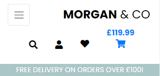

<h1 align="center">Morgan & Co</h1>

[View the live project here.](https://morgan-and-co.herokuapp.com/)

Welcome to the brand new Morgan & Co furniture website.

<!-- <h2 align="center"></h2> -->

Milestone Project 4, for [Code Institute](https://codeinstitute.net/)'s Diploma in Web App Development.

Morgan & Co is a family-run furniture retailer based in Wales, UK. The company specializes in sofas, chairs, tables and other home furnishings. For many ficticious years, the company has succesfully operated through word-of-mouth and profiting from a respected family reputation, with steady growth eventually leading them to becoming a leader in their industry - proudly displaying thier motto of "If it can fit through your front door, we'll sell it - if not, we'll take the door off - free of charge". After a recent family intervention, the company has decided to take a leap of faith into the last century and launch their brand new website to further boost sales.

# Table of Contents
* [Website Concept](#website-concept)
* [Project Goals](#project-goals)
* [User Stories](#user-stories)
    - [As a New Visitor](#as-a-new-visitor)
    - [As an Unregistered User](#as-an-unregistered-user-including-all-prior-stories)
    - [As a Shopper](#as-a-shopper-including-all-prior-stories)
    - [As a Registered User](#as-a-registered-user-including-all-prior-stories)
    - [As a Store Owner](#as-a-store-owner-including-all-prior-stories)
* [Aesthetic Design](#aesthetic-design)
    - [Wireframes](#wireframes)
        - [Desktop](#desktop)
        - [Tablet](#tablet)
        - [Mobile](#mobile)
    - [Colour Palette](#colour-palette)
    - [Images](#images)
    - [Font](#font)
* [Database](#database)
    - [Data Schema Design](#data-schema-design)
* [Technical Design](#technical-design)
* [Accessibility](#accessibility)
* [Features](#features)
    - [Interactive Elements and Features](#interactive-elements-and-features)
    - [Page Features](#page-features)
* [Technologies Used](#technologies-used)
    - [Languages Used](#languages-used)
    - [Frameworks, Libraries, Programs and Tools Used](#frameworks-libraries-programs-and-tools-used)
* [Testing](#testing)
* [Future Updates](#future-updates)
* [Initial Setup and Deployment](#initial-setup-and-deployment)
* [Credits](#credits)

# Website Concept
The website will be a fully-interactive e-commerce website, with the main purpose to drive sales for the company.  
This will be achieved by clearly and smartly displaying their products, company information and further necessary information.

It will also serve as a place to bring more exposure, from otherwise unknown custom and enter a market they currently aren't in. The website will display all products that the company sells, allowing vistors to browse through their vast range. Visitors can seamlessly browse through the website, through the product range and through specific categories and ranges.

Visitors can register for free which in turn allows for more features to be accessible. Although sales are not limited to users - a decision that will help ease the sales process - registered users will have features and possibilities that will enhance their experience and decision making - including raising the chances of return custom e.g wishlists, saving profile info and review posting.  
All website features will be documented in this README document.

The website will clearly display information for first-time visitors, returning visitors and customers including the company contact information via social media links and relevant customer information pages (About us, Contact Us and the relevant delivery and returns pages). The website is fully responsible on a range of devices - from hand-held devices to larger screens such as monitors and even TVs. This is to ensure that as many people as possible can visit and use the website.

The website is welcoming to a range of visitors, and gives a very nice user-experience with plenty of on-screen prompts on dispaly and a whole host of intuitive, secure technology in the background to ensure a smooth, safe, efficent user-friendly experince.

The website is easily maintainable through the admin portal, but also allows admin/superusers to manage some aspects from the website itself. This is obviously of huge importance. To have a self-manageable store for the store owner to easily update and manage their own store online, without having to contact the website developer. The website and the features built in to design, will allow the website to be scalable as the store owners add more products and in turn more user interactivity.

[Back to table of contents](#table-of-contents)

# Project Goals
This is the fourth and final project submission for Code Institute's 'Level 5 Diploma in Web Application Development' course. The task is to design, build and implement a full stack e-commerce website that incorporates Django/Python. A shopping bag and checkout app will serve as the stores purchasing method, using Stripe's online payment processing system. This will be fully functioning, secure and tested with feedback prodvided to the website's users upon successful or unsuccesful payments.


The project will implement CRUD features on all levels (visitor, registered user, admin), on a relational database management sytem. The project can serve multiple approches to database management and CRUD functionality.

The projects goals are to emulate an application that's as close-to-ready to launch - intending for the website to be ablt o passed over to the store owners and for them to manage the rest. , with manual and automated testing covering all aspects of the project. An opportunity to  showcase showcase the creators backend and frontend development skills learned during the enture course, to show more proficency in aspects already exposed to (HTML, CSS, JS, Bootstrap, Python to name a few) and to also fully embrace the practice of the 4th projects main study-material - being, Django, Stripe. The goals are to keep building on the skillset aquired throughout this course. Code Institute's brief was to develop a project that utilized a conventional relational database with a focus on CRUD functionality.


CRUD functionality
Admin portal, user and superuser, allauth, stripe, testing
Relational database


mention store owner management, superuser capabilities, registered user exclusive features, and whats available to all
admin portal breakdown?


[Back to table of contents](#table-of-contents)

# User Stories

Following are the goals that the website should provide for each user.

### As a New Visitor
| User Story ID | I want to: | So that I can: |
| ------------- | ----------| ------------- |
| 001           | Be able to access and view the website on the device I'm using. | View the website without having to change my device. |
| 002           | Immediately understand the purpose of the website. | Decide if it's something I'm interested in. |
| 003           | Be able to navigate the website with ease. | Discover what the website is about and find all that I need. |
| 004           | Find the website design visually pleasing. | Have a pleasant experience. |
| 005           | Be able to find help and information about the website and company. | Decide if the company is trustworthy and reputable. |
| 006           | Be able to contact the company if I wish to, by my prefer method. | Easily contact the company and better understand any further queries I have. |
| 007           | Have a reason to return. | Explore the website further. |

### As an Unregistered User (including all prior stories)
| User Story ID | I want to: | So that I can: |
| ------------- | ----------| ------------- |
| 101           | Access and view the website on a number of different devices. | Visit the website from any device I'm currently using or would like to use in the future. |
| 102           | Be able to easily register for an account. | Have my own profile, manage all that I wish from there and make it easier to return to the website. | 
| 103           | Buy products without registering. | Save time without needing or wanting to create an account. |

### As a Shopper (including all prior stories)
| User Story ID | I want to: | So that I can: |
| ------------- | ----------| ------------- |
| 201           | View a list of all products. | See every item that the company sells. |
| 202           | View specific product details. | To gather all information that I need about a certain product e.g price, description, rating and reviews. |
| 203           | To quickly search for products by my preferred criteria e.g. name, description. | So that I can quickly find products that suit my desires. |
| 204           | Easily see what I've searched for and the number of results found. | Quickly see whether the product I want is available. |
| 205           | Easily sort products by name, price and more. | To save time and better my decision-making. |
| 206           | Be able to filter products by items. | Find specific items I need without searching the entire product range. |
| 207           | Be able to filter products by different rooms. | Find a range of items that suit a specific room. |
| 208           | Find new items. | So that I can find what products are new to the store. |
| 209           | Find clearance items. | So that I can find what products are on sale to be cleared and take advantage of the savings. |
| 210           | Quickly find out about delivery details. | So that I gather information about cost and when I should receive my order. |
| 211           | Read product reviews. | So that I make a better decision about each product. |
| 212           | Select the quantity of items I wish to purchase. | Easily make changes without unnecessary steps/clicks to alter the quantity. |
| 213           | Be informed of my bag total. | So that I can be easily informed of how much I'm spending and control that. |
| 214           | Easily view my bag. | So that I can see what products I have in my bag, the cost and the quantity before checkout. |
| 215           | Know that my information and payment details are safe and secure. | So that I can shop with confidence and feel safe about giving my personal details. |
| 216           | Easily enter my payment information. | Check out quickly without needing to create an account or following numerous steps. |
| 217           | Recieve an order review after checkout. | So that I can quickly see my purchase and check if I purchased all that I needed. |
| 218           | Recieve a confirmation via email of my order. | Keep the order confirmation as proof of purchase. |

### As a Registered User (including all prior stories)
| User Story ID | I want to: | So that I can: |
| ------------- | ----------| ------------- |
| 301           | Have my own personal profile with some management options. | Manage my own personal information. |
| 302           | Have access to more features. | Justfiy registering to the website. |
| 303           | Recieve an email confirmation after registering. | Verify that my account registration was successful. |
| 304           | Be able to edit my personal information e.g. address, email. | Manage my own personal information in case they change. |
| 305           | Easily sign in and sign out of my account. | Quickly access or leave my personal profile when using the website. |
| 306           | Be able to recover my password in case I forget it. | Recover access to my account and all my personal information. |
| 307           | Have access to my order history. | Can view all previous orders. |
| 308           | Add product reviews. | Leave reviews on specific products. |
| 309           | Edit product reviews. | Edit reviews on specific products. |
| 310           | Delete product reviews. | Delete reviews on specific products. |
| 311           | Add items to my wishlist. | Easily access a list of products I'm interested in viewing again and/or purchasing. |
| 312           | Delete specific products from my wishlist. | Delete specific products that I no longer wish to have. |

### As a Store Owner (including all prior stories)
| User Story ID | I want to: | So that I can: |
| ------------- | ----------| ------------- |
| 401           | Have more control and features than any other user. | Manage my store easily. |
| 402           | Have access to an admin portal. | Access and manage all store tasks in greater depth. |
| 403           | Be able to create other super user accounts. | Create super user accounts with advanced control. |
| 404           | Be able to add a product to my store. | Add new product to my store. |
| 405           | Be able to edit/update a specific product. | Change product prices, descriptions, images and other product criteria. |
| 406           | Be able to delete a product from my store. | Remove items that are no longer for sale. |
| 407           | Be able to add product categories (including basic Catgegory, Room and Specials.) | Add new categories to my store. |
| 408           | Be able to edit/update product categories (including basic Catgegory, Room and Specials.) | Edit/Update any current store categories. |
| 409           | Be able to delete product categories (including basic Catgegory, Room and Specials.) | Delete any current categories. |
| 410           | Be able to add product reviews to any specific product. | Leave storeowner reviews on any specific products. |
| 411           | Be able to edit/update all product reviews. | Edit/Update any user reviews on any specific products. |
| 412           | Be able to delete any specific product reviews. | Delete any user reviews on specific products. |
| 413           | Be able to add user wishlist. | Add new wishlists for any registered user. |
| 414           | Be able to edit/update all user wishlsts. | Edit/Update any current user wishlist. |
| 415           | Be able to delete user wishlists. | Delete any user wishlist from their profile. |
| 416           | Be able to add user account and info. | Create and control user account and info on my website. |
| 417           | Be able to edit/update all user account and info. | Edit/Update any current user account and info on my website. |
| 418           | Be able to delete user accounts and info. | Delete any current user account and info from my website. |

[Back to table of contents](#table-of-contents)

# Aesthetic Design
## Wireframes
Wireframes were drawn using Balsamiq at the beginning of the project. They were referenced throughout the design and building of the website. Following are a series of images showing the Morgan & Co website on the three main screen sizes: mobile, tablet and desktop. Every major section of the website is also included.
### Mobile
[Mobile Wireframes here](docs/wireframes/mobile-wireframes.pdf)
### Tablet
[Tablet Wireframes here](docs/wireframes/tablet-wireframes.pdf)
### Desktop
[Desktop Wireframes here](docs/wireframes/desktop-wireframes.pdf)

## Colour Palette

The Morgan & Co website colour palette is predominantly a dark against light and vice versa approach. Black and white. Dashes of brighter colours are present for the interactive elements in an effort to highlight these and to make a drastic contrast between said interactive elements and other non-interactive content. This concept was decided on early in the projects inception, with a light background providing an ideal canvas to build content upon. The predicted range of colours that comes with furniture and their images - brown/red/black dark leathers, lighter shades with fabric, brown woods, plastics etc. - would all add to a vast range of colours that brought life to the website. It was important to not drown users in an abundence of colour or clutter, and to allow the focus to be on the products.


The main background image (background-blue.jpg) provides a complimentary pastel colour, which fits with the font colours and button-styling colours chosen. It evokes a relaxing and gentle mood - helped by the opacity level neutralizng the vividty of the image. This is all to distinguish depth, and to allow headings, text and buttons to blossom at the forefront. Stylistically, this is in keeping with the overall feel of the website and the brand itself, but equally so, it's vital for content readability and the overall user experience.

The main text colour throughout the website is black (rgb(0,0,0)). The company name, page headings, product pages and information, the website's navbar and footer are almost all black text, usually set against light or even white backgrounds. This is to ensure maximum readability and to draw the users eyes to focus on what's importannt - the products. This creates a constant and obvious contrast between the text and the the much lighter, white background. Whenever there is a possiblibility of a contrast issue, the text colour is reversed to white (rgb(255,255,255)), again to ensure clarity - e.g. the Morgan & Co homepage - the white text colour stands out clearer than a black text colour would against the background image. For product images found on the product pages, the Opal (rgb(170,198,198)) colour is used as a background colour for the buttons when hovering over them. This creates the necessary platform for the text to be seperated from the image itself and to raise the contrast in a positive manner.

By default, all buttons have a consistent style, size and layout throughout the website. See more in the buttons [Features](#features) section.

Some text colour changes are seen throughout the website - red, usually reserved for error or validation purposes to grab the users attention. It is also used for the Clearnace and New Arrivals specials category - something the company wishes to promote and for users to be drawn in by. Otherwise, blue is used very very rarely and reserved for Edit buttons to again help with contrast. Gold band on toast free delivery promotion. This is obviously to entice users to keep spending to trigger their free delivery thrreshold - beneficial for shoppers and the company alike.


!!!!!!!!!!!??????????CONTAST CHECKER HERE????!!!!!!!!!!!!!!!!!!!
Here is the [Contrast Checker](https://webaim.org/resources/contrastchecker/) tool used to show just how powerful something so simple can be:


img
Further contrast checks were made in the [Testing](TESTING.md) documentation, especially during Lighthouse checks. Adjustments were made to favour readability.

## Images

The use of images is vital in creating allure and desire, especially for a furniture retailers e-commerce site. Users are drawn by what they see. The background-blue.jpg homepage image dominates the screen and draws the attention of new visitors. The main product pages and images, well designed in their page spacing and layout and responsive in their scale/sizing and quality will encourage visitors to continue browsing the website, in the hope of leading to sales.

It's vital for the theme to be clear and obvious. The background image makes the website recognizable and memorable so visitors recall and return to it, which in turn will draw more eyes to the website. This, along with the CSS styling, colour palette and branding solidifies the theme.

## Font

The Morgan & Co website uses the Poppins font. It provides that clean and clear style without compromising on readability - a vital design feature for any website. This is available for free via [Google Fonts](https://fonts.google.com/). Sans Serif is used as a secondary option in case of failure to load the font into the website correctly. Poppins is a font often used in designs, so it is both attractive and appropriate.

There are some stylistic changes to the font (the use of ```<strong>```), but mostly with just colour for impact, attention or contrat and readability purposes.

When the underline animation appears underneath the navbar text on cursor hover, they serve as hints to the user that that element can be interacted with.

[Back to table of contents](#table-of-contents)

# Database
The database is setup via a model template.  
Locally, using Django's built-in sqlite.  
Initially using Heroku's postgres add-on database, which eventually was changed to use elephantSQL due to Heroku's announcement to end some of their free-tier services.

## Data Schema Design
Here is the Database Schema layout for the Morgan & Co website:


It shows each table and model, what data is kept, their type and how they are linked together.
This schema is vital in developing the website's functionality, its features and what users are capable of doing. A breakdown of every feature can be found here [Features](#features) along with the code, and how everything links together.

The data schema shows how all data is connected. Morgan & Co uses a relational database.
Model breakdown:  
- UserProfile = extends through django's User model.  
- Order =  
- OrderLineItem =  
- Product =  
- Category =  
- Room =  
- Special =  
- Review =  
- Wishlist =  

[Back to table of contents](#table-of-contents)

# Technical Design

Once the user goals and the projects intentions were set out, the next step was to design the technical aspects of the the Morgan & Co website.

apps = individual apps, custom built, models, templates, urls and views here
morgan_and_co = main setup, main settings, main urls and link to all website and other apps etc
model.py within apps = 
views.py within apps = main CRUD functions and data manipulation are written here. Server-side control for the back-end.


media = images
static = 
templates folder = contains all html webpages found on the Morgan and Co website
includes

Procfile - to link to Heroku


## Defensive Programming
Used throughout the Morgan & Co website. By linking the session cookie to the UserProfile or User modules, the security levels and accessibility can be controlled:
```
if not request.user.is_superuser:
        messages.error(request, 'Sorry, only store owners can do that.')
        return redirect(reverse('home'))
```
When not met, the current user/visitor is presented with a toast message to inform them.


Alternative content and routes are used to present the user with information when trying to access restricted website content

logic in templating, front end, back-end, validation etc. covers all aspects. security.

@login_required
try/excpet
error handling
if else
check if annonymous, user, registered, author etc
e.g. registered users only
e.g. admin/store owners only
e.g. if they already have left a review
e.g. if they already have product in wishlist
form validation?
404/error pages

redirect to sign up, sign in, red text message, hide content, show content etc

Toasts

## Toast

test these

toast_success = Success!
- geenrally positive, or to confirm an action the user requested and has succeeding in doing so
- add product
- add review
- add item to wishlist
- add item to bag
- user signs in
- user signs out
-edit, update?
admin?

toast_error = Error!
attempt to manually access the checkout page, without any items in the shopping bag


toast_info = Alert!
Edit Review - You are editing the review
Edit Product - You are editing the review
-edit, update? - you are editing review/preoduc/etc?

toast_warning = Warning!
- leaves checkout_success and no items in bag?


## Modal
Modals form an integral part of the websites design. They act as a simple reminder to check if the users actions were intended and thus create a great user-friendly experience. Modals prompt the user to think again and to confirm or cancel the action so that they can be certain or even to avoid making a mistake (such as accidentally clicking a button and instantly removing their review from a product). [Bootstraps modal](https://getbootstrap.com/docs/4.0/components/modal/) was used and then tweaked. The button in the modal itself deletes the related data:
```
<a class="text-black" href="">
    Remove Review
</a>
```
Whereas the following is just to trigger the modal itself:
```
<button type="button" class="btn btn-light text-danger" data-toggle="modal" data-target="#delete_{{ review.id }}">
    <div><i class="fas fa-trash fa-lg text-black"></i></div>
    Remove Review
</button>
```
As long as there is an id linking the modal trigger button and modal popup itself:
```
id="delete_{{ review.id }}"
```

## Email
The website uses Gmail to send company infromation and account related emails

new account reigstration - users must click the link in email to confirm and have access to their account
reset password links
order confirmations are sent as a backup to the customers inbbox once a purcahse has been made


## Stripe
Stripe is used to handle payments.

## AWS
AWS is used to store

[Back to table of contents](#table-of-contents)

# Accessibility
Extremely important aspect.

- Semantic design.
- The use of alt to describe images and other content.
- Aria-labelledby to link sections.
- Colour and contrast considerations and testing.
- Adding labels to forms.
- Prompts to help guide users.

[Back to table of contents](#table-of-contents)

# Features
## Interactive Elements and Features
Following is a list of all interactive elements and features found on the Morgan & Co website:

### Navbar




- Fully-responsive nav bar (including mobile nav bar) accessible on all pages of the website
- Clear and obvious navbar links to other pages within the website, including mouse-hover effects to enhance the users experience.
- Mobile hamburger menu, toggles to show/hide the product menu options and a link to the homepage.
- The Morgan & Co logo/name is seen at all times whether centrally located on larger screens or adjusted to smaller screen-sizes. This is vital for brand consistency and serves as a simple way of reminding the user of the company's name. The logo/name is clickable and always takes the user to the Morgan & Co homepage.
- 'My Account' logo, which includes 'Sign In', 'Sign Up' or 'Sign Out' depending on if user is signed in our not. 'Product Management' (for admin only) and 'My Profile'. All clickable and direct to the relvant pages.
- 'Wishlist' logo button. A hollow/empty heart-shaped icon when no items in user Wishlist. Fills to a black heart if there is at least 1 item present in the Wishlist. Logo and feature completely hidden unless user is signed in.
- Shopping Bag. Logo with the current users bag total. Takes user to the shopping bag page when clicked.
- The delivery banner promoting free delivery on all orders over £100.

### Search Bar
- A search bar is located just under the page logo links - built into the navbar, so always present. Quick, easy access for user preferred searches. The user can search by name, description or any keyword they choose and either use a keyboard ENTER entry, or use the 'Search' logo button to search though the entire websites database of products.

### Footer
- Fully responsive footer which closely matches the design and colour palette of the top navbar.
- Important links in footer, including quick product list and customer information for contact, delivery, refunds etc.
- Social links in footer, linking to the companys social media accounts and provides alternative forms of contact. Address with full contact info too.
- Name of website along with copyright info in footer.

### Sort-by filtering


- A 'sort-by' feature on all product listing pages to sort products by specific criteria, which are:
    - Price (low to high) - filters current products by their lowest price (shown first) to highest price
    - Price (high to low) - filters current products by their highest price (shown first) to lowest price
    - Name (A-Z) - filters current products by their alphabetical order based on product name (products beginning with A shown first)
    - Name (A-Z) - filters current products by their alphabetical order based on product name (products beginning with Z shown first)
    - Category - 

### Buttons
- The buttons predominantly serve as triggers for users to achieve something they wish. An action is called on those buttons and are linked on the back-end.

### Interactive Toasts
- Messages appearing at the top of the webpage whenever a user or admin completes a task - by either adding, editing or deleting information. They are informed of this.


## Page Features
There are universal features that are present throughout the Morgan & Co website. These features are:
- Navbar, explained [here](#navbar)
- Footer, explained [here](#footer)
- Buttons, explained [here](#buttons)
- Toasts, explained [here](#interactive-toats)
- Search Bar, explained [here](#search-bar)
- Responsive on all device sizes - from 320px upwards to larger desktops reaching 1200px and more.
- All clickable images, buttons, links etc have a hovering cursor to signify that the element can be interacted with. The majority of these elements being visually promted either through a short animation, colour change or highlighting.
- Back-to-top button. Guides the user back to the top of the page once interacted with. Userful for pages with lengthy content.

Here's a breakdown of all the design features on each of the main webpages within the Morgan & Co website:

### - Morgan & Co home page


The home page for the Morgan & Co website. All visitors will be welcomed by this page. The features include:
- A full-screen background image (background-blueg.jpg), a promotion/brief message and then a button that leads to the products page.

### - The Products pages


This is where every product on the Morgan & Co website is listed. All visitors to the website can view this webpage, whether they are registered or not. The features include:
- Page title centrally located at top of page, just under the navbar.
- Choice of buttons that link to further filter of the products, if user has already chosen to filter by navbar menu choices. Informs user of current choice of product filtering and/or possibilities.
- A list of every product on the website presented in borderless card format, with product image, name, price and related category, room and special links (if applicable).
- Ability to click on each product image to advance to the full product detail (/product_detail/product_id/). Image fades slightly and a 'More Info' button appears to make it clear to the user.


### - Filter Products by Category, Room and Special


The Filter Products by Category Room and Special pages are where users can view every product listed in a certain product range (depending on which product range they choose on the nav bar menu options, or product links page) All visitors to the website can view this webpage. The features include:
- Page title and subsoquent buttons for further filtering if necessary.
- A list of every product within the selected product Category/Room/Special presented just as products from the main products page would. Same related product info and interactions available.

### - Product Detail page


The Product Detail page is where the user can see the full product details for the product they selected. All visitors to the website can view this webpage. The features include:
- Product Name in large, bold text.
- A large image of the product, that can be clicked on again to see it's original quality and size.
- All product information presented, which includes product price, rating, category, room, special, sku, description.
- Current product rating, that automatically updates whenever a user or admin adds/edits/removes a review with rating.
- If the admin/store owneris signed in, the 'Edit Product' button appears besides the product detail information and forwards the admin/store owner to the 'Edit Product' (/edit/product_id/) page.
- If the admin/store owner is signed in, the 'Remove Product' button appears besides the product detail information and once clicked allows the admin/store owner to remove the product from the website. Before doing so, the admin/store owner is met with a modal that asks for confirmation on whether they want to delete that product or not. Admin/store owner must click 'Remove Product' again to confirm this (which will then remove the product from the website and the database), otherwise they can cancel by clicking the 'Cancel' button or by just clicking off screen or pressing ESC on the keyboard and return to the product detail page, with no change taken place and the product remaining on the website. 
- The 'Edit Product' and 'Remove Product' are both hidden if not the admin/store owner.
- The 'Keep Shopping' button will return the user back to the main products page when clicked.
- The 'Add to Bag' will add that product to the users shopping bag when clicked.

Wishlist section
- The feature and button are only available to see for users that are signed in
- 'Add to Wishlist' button will add that current product to the users Wishlist. User will be informed of this and the button will then disappear and a text to notify that the product is already in their Wishlist will replace it. A link to the Wishlist will also be present.

Review section
- Product Reviews title showing the current number of reviews listed for that product.
- Product Reviews listed from most recently newest review first.
- Reviews to show review authour, review text, rating and date.
- A review form to appear next to the list of reviews - or hidden if user has already left a review for that product, with a message thanking them for their review.


- If the review was submitted by the current user, the 'Edit Review' button appears besides that review. Button click forwards the user to the 'Edit Review' (/edit/review_id/) page.
- If the review was submitted by the current user, the 'Remove Review' button appears besides that review and allows the user to delete their review when clicked. The user is met with a modal that asks for confirmation on whether they want to delete that review or not. User must click 'Remove Review' again to confirm this (which will then remove the review from the website and the database), otherwise they can cancel by clicking the 'Cancel' button or by just clicking off screen or pressing ESC on the keyboard and the review will remain on the product detail page. 
- The 'Edit Review' and 'Remove Review' buttons are hidden for all users who are not signed-in to the website. The buttons are always visisble to admin. They are limited to the registered user if they are signed in and had submitted that review.
- If user is not signed in, they will see a message asking them to Sign In (linked the Sign In page when clicked) to leave a review.

### - Edit Review


### - Wishlist page


### - My Profile page


My Profile. This is where the users personal information is stored. Only registered users can view this page. The features include:
- Page title, including the users username at the top of the page.
- An editable form that is either empty or contains previously saved user information including delivery address.
- 'Update Infomration' button, when clicked will update the form and save that information to user profile.
- A table of previously made orders through the Morgan & Co website, with a clickable link to see the full order details.
- The 'Wishlist' button at the bottom of the page, when clicked directs user to their 'Wishlist' (/wishlist/) page.

### Product Management - Add Product page


The Add Product page is for the admin/store owner to add their products website via a form. Only admin/store owners can use this feature. The product is added to the main products page and is avaiable on all relevant pages that the categories, rooms and specials apply to. It will also be searchable in the search bar for user-inputted queries. The features include:
- Page title and form title at top of page.
- Validation on all inputs.
- All inputs linked to the database.
- Category dropdown - Choice of selectable options. The 'Category' section the product will be placed in. Allows users to search and filter by this. Listed on product pages and product details page. Admin has control over which categories are added to the website/database.
- Room dropdown - Choice of selectable options. The 'Room' section the product will be placed in. Allows users to search and filter by this. Listed on product pages and product details page. Admin has control over which categories are added to the website/database.
- Special dropdown - Choice of selectable options. The 'Special' section the product will be placed in. Allows users to search and filter by this. Listed on product pages and product details page. Admin has control over which categories are added to the website/database.
- SKU input - The product sku number that will be presented for all to see on the product detail pages.
- Product Name input - The product name that will be presented for all to see on all of the product pages.
- Product Description input - A text input to accept the admins description of their product. It will be presented for all to see on the product detail pages.
- Product Price input - The product price that will be presented for all to see on all of the product pages.
- Ability for admin to upload a product image. This is validated and has some error handling linked to it.
- Product Description - A text input to accept the admins description of their product.
- 'Add Product'. This button submits the form to the website/database if all inputs are valid and met. Admin is informed of product addition via toast. The product is then added to the website and can be viewed, searched for, edited, removed etc.
- 'Cancel' button. Leaves the page and returns to the main products page.

### Product Management - Edit Product page


The Edit Product page is for admin to edit the chosen product via a form. Only the store owner/admin can use this feature. The edited product is updated when the form is submitted and found in the same places as the original product. The information expected from the admin is the same as the Add Product page. The features include:
- Validation on all user inputs.
- All inputs seen on Add Product page, with all inputs presented again. The current product details will be populated in each input, ready to be edited.
- 'Edit Product'. This button submits the form to the database if all inputs are valid and met and updates that specific product.
- 'Cancel' button. Leaves the page and returns to main products page.

### - Shopping Bag page


### - Checkout page


### - Checkout Success page


### - Sign In page


The Log In page is where visitors can enter their details and log in to their account. All visitors to the website can view this webpage. The features include:
- 'Log In' title on top of the page.
- Username input with placeholder and validation applied.
- Password input with placeholder and validation applied.
- 'Log In' button. When clicked, the user is forwarded to their personal My Cabinet (profile.html) page.

### - Sign Out page


The Sign Out page is where visitors are asked to confirm if they'd like to Sign Out of the Morgan & Co website, having already clicked on the Sign Out link from the My Account menu.
Features include:
- Sign Out title on top of the page.
- Text above buttons to ask if user is sure they'd like to sign out.
- 'Sign Out' button. When clicked, will sign user out of their account and lead them back to the home page.
- 'Cancel' button. When clicked, the user is taken to the homepage, but remains signed in to their account.

### - Sign Up page


The Sign Up page is where visitors can enter their details for the first time to register their new account. All visitors to the website can view this webpage. The features include:
- 'Sign Up' title on top of the page.
- Username input with placeholder and validation applied.
- Password input with placeholder and validation applied.
- 'Register' button. When clicked, the user is forwarded to their personal My Cabinet (profile.html) page.

### - Password Reset


[Back to table of contents](#table-of-contents)

# Technologies Used
## Languages Used

-   [HTML5](https://en.wikipedia.org/wiki/HTML5)
-   [CSS3](https://en.wikipedia.org/wiki/Cascading_Style_Sheets)
-   [JavaScript](https://en.wikipedia.org/wiki/JavaScript)
-   [Python3](https://en.wikipedia.org/wiki/Python_(programming_language))


## Frameworks, Libraries, Programs and Tools Used

1. [Google Fonts:](https://fonts.google.com/)
    - Google fonts is used to import the 'Poppins' font into the style.css file which is used on all fonts within the website.
1. [Font Awesome:](https://fontawesome.com/)
    - Font Awesome is used on all pages throughout the website to add icons for aesthetic and UX purposes.
1. [jQuery:](https://jquery.com/)
    - jQuery is used to simplify and manipulate some tasks instead of regular JS.
1. [Git:](https://git-scm.com/)
    - Git is used for version control by utilizing the Gitpod terminal to commit to Git and Push to GitHub.
1. [GitHub:](https://github.com/)
    - GitHub is used to store the projects code after being pushed from Git.
1. [Gitpod:](https://gitpod.io/)
    - Development environment to build the website.
1. [Balsamiq:](https://balsamiq.com/)
    - Balsamiq is used to create the [wireframes](#wireframes) during the design process.
1. [Eye Dropper:](https://eyedropper.org/).
    - This colour picker tool was used to to pick and experiment with colours.
1. [Coolors:](https://coolors.co/)
    - This tool was used to to setup the colour palette [here](#colour-palette).
1. [TinyPNG:](https://tinypng.com/)
    - TinyPNG is used to optimize images used in the website and documentation.
1. [Miscrosoft Paint:](https://support.microsoft.com/en-us/windows/get-microsoft-paint-a6b9578c-ed1c-5b09-0699-4ed8115f9aa9)
    - Microsoft Paint is used to crop and resize images and editing photos for the project.
1. [WPS Office:](https://www.wps.com/)
    - WPS Office is used to create the flow charts, the tables found in the [Testing](TESTING.md) and for spell-checking.
1. [Am I Responsive?:](http://ami.responsivedesign.is/)
    - Used to create the image at the very top of this document.

Other:
- PostgreSQL database - initially though heroku's postgres add-on, then elephantSQL
- PsycoPG2 - database adapter. library for connecting Python to PostgreSQL.
- bootstrap
- heroku
- 


stripe, aws
website to create logo

Requirements for Installs:
- asgiref==3.5.2
- boto3==1.26.14
- botocore==1.29.14
- dj-database-url==0.5.0
- Django==3.2.16
- django-allauth==0.41.0
- django-countries==7.2.1
- django-crispy-forms==1.14.0
- django-storages==1.13.1
- gunicorn==20.1.0
- jmespath==1.0.1
- oauthlib==3.2.2
- Pillow==9.3.0
- psycopg2-binary==2.9.5
- python3-openid==3.2.0
- pytz==2022.5
- requests-oauthlib==1.3.1
- s3transfer==0.6.0
- sqlparse==0.4.3
- stripe==4.2.0

coverage - used for automated testing, to check how much of the code is tested


[Back to table of contents](#table-of-contents)

# Testing

Due to the extensive testing necessary for the Morgan & Co website, the full documentation can be found [TESTING](TESTING.md).

[Back to table of contents](#table-of-contents)

# Future Updates
There are many planned updates arranged for the Morgan & Co website that include but are not limited to:

* Blog
* Introduction of more social features such as:
    - Social media links to share, comment, link etc
    - Link email for subscription, mail etc
* Link social media for signing in/registering, subscription, mail etc
* Users able to:
    - Delete profile
    - Edit profile further
* More admin/superuser rights from the website:
    - Create, Edit, Delete Categories
    - Create, Edit, Delete Rooms
    - Create, Edit, Delete Specials
* Quick-buy options directly from the product page

[Back to table of contents](#table-of-contents)

# Initial Setup and Deployment

[Back to table of contents](#table-of-contents)

# Credits
## Code
## Inspiration
## Content & Media
## Acknowledgements

[Back to table of contents](#table-of-contents)