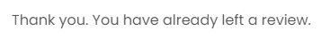
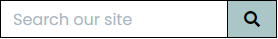
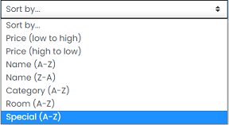
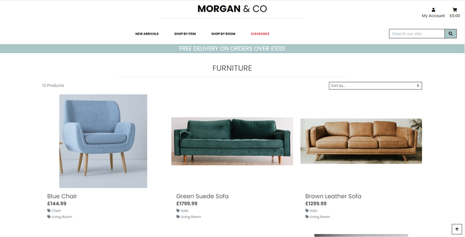
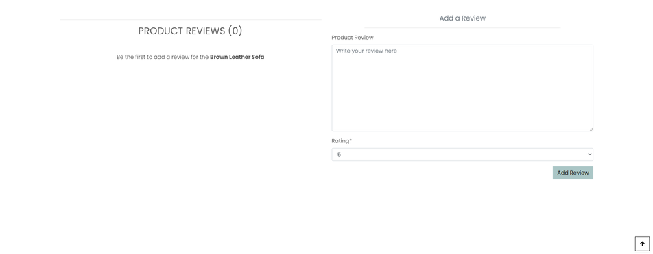
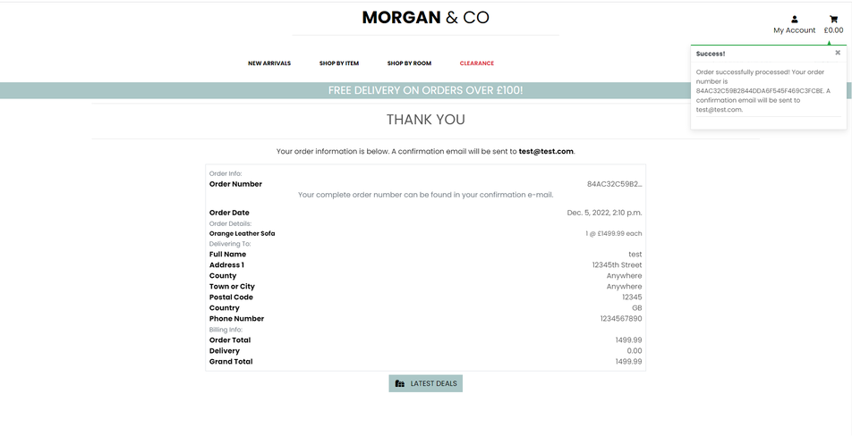
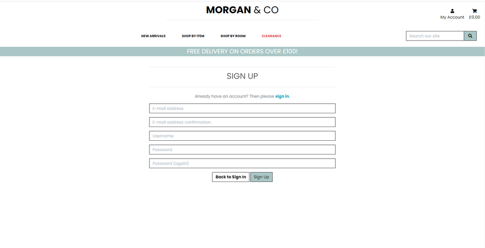

<h1 align="center">Morgan & Co</h1>

<h2 align="center"></h2>

Welcome to the brand new Morgan & Co website.

[View the live project here](https://morgan-and-co.herokuapp.com/).

Morgan & Co is a family-run furniture retailer based in Wales, UK. The company specializes in sofas, chairs, tables and other home furnishings. For many ficticious years, the company has succesfully operated through word-of-mouth and profiting from a respected family reputation. Steady growth eventually lead Morgan & Co to becoming a leader in their industry - proudly displaying thier motto of <strong>"If it can fit through your front door, we'll sell it - if not, we'll take the door off - free of charge"</strong>. After a recent family intervention, the company has decided to take a leap of faith into the last century and launch their brand new website to further boost sales.

# Table of Contents
* [Website Concept](#website-concept)
* [Project Goals](#project-goals)
* [User Stories](#user-stories)
    - [As a New Visitor](#as-a-new-visitor)
    - [As an Unregistered User](#as-an-unregistered-user-including-all-prior-stories)
    - [As a Shopper](#as-a-shopper-including-all-prior-stories)
    - [As a Registered User](#as-a-registered-user-including-all-prior-stories)
    - [As a Store Owner](#as-a-store-owner-including-all-prior-stories)
* [Aesthetic Design](#aesthetic-design)
    - [Site Flow](#site-flow)
    - [Wireframes](#wireframes)
        - [Desktop](#desktop)
        - [Tablet](#tablet)
        - [Mobile](#mobile)
    - [Colour Palette](#colour-palette)
    - [Images](#images)
    - [Font](#font)
* [Database](#database)
    - [Data Schema Design](#data-schema-design)
* [Technical Design](#technical-design)
* [Accessibility](#accessibility)
* [Features](#features)
    - [Interactive Elements and Features](#interactive-elements-and-features)
    - [Page Features](#page-features)
* [Technologies Used](#technologies-used)
    - [Languages Used](#languages-used)
    - [Frameworks, Libraries, Programs and Tools Used](#frameworks-libraries-programs-and-tools-used)
* [Testing](#testing)
* [Future Updates](#future-updates)
* [Deployment](#deployment)
* [Credits](#credits)

# Website Concept
The website will be a fully-interactive e-commerce website, with the main purpose to drive sales for the company.  
This will be achieved by clearly and smartly displaying their products, company information and any further necessary information.

It will also serve as a place to bring more exposure to their company, from previously unnatainable custom and to enter a new market. Visitors can seamlessly browse through the websites vast range of products, through specific categories or even through personalized searches. They are welcome to Sign Up for free, which allows them access to more of the websites features.

Vitally, sales are not limited to just registered users - a decision that will help ease the sales process for all vistors to the website, which increases the likelyhood of generating sales. 

Having said that, registered users will have features and possibilities that will enhance their experience and decision making - including raising the chances of return custom. These include but are not limited to:
- Personal wishlists.
- Personal profile.
- Review posting.
All website features will be documented in this README document.

The website will clearly display information for all visitors, including the company contact information via social media links and helpful customer information pages (About us, Contact Us and the relevant delivery and returns pages). The website is fully responsible on a range of devices - from hand-held devices to larger screens such as monitors and even TVs. This is to ensure that as many people as possible can visit and use the website.

The website is welcoming to a range of visitors, and gives a very nice user-experience with plenty of on-screen prompts on dispaly and a whole host of intuitive features, matched with secure technology working in the background to ensure a smooth, safe, efficent user-friendly experince.

The website is easily maintainable through the admin portal, but also allows admin/store owners to manage aspects of their store by just signing in to the website itself. This is obviously of huge importance and allows the store owner to easily update their store and any time, without having to contact their website developer or miss out on business opportunities. The website and the features built in to the design means it's adaptive and scalable - the store owners can add more products and in turn more user interactivity. This means that Morgan & Co is very much future-proofed.

[Back to table of contents](#table-of-contents)

# Project Goals
This is the fourth and final project submission for [Code Institute](https://codeinstitute.net/)'s 'Level 5 Diploma in Web Application Development' course. The task is to design, build and implement a full stack e-commerce website that incorporates Django/Python. A shopping bag and checkout app will serve as the stores purchasing method, using Stripe's online payment processing system. This will be fully functioning, secure and tested with feedback prodvided to the websites users.

The projects goals are to emulate an application that's as close-to-ready to launch - intending for the website to be able to be passed over to the store owners and for them to manage the rest. 

This project provides an opportunity for the developer to showcase the backend and frontend skills aquired during the length of the course. 

The project will display proficency in technical aspects already exposed to (HTML, CSS, JS, Bootstrap, Python to name a few) and to also fully embrace the practice of the 4th projects main study-material - being, Django, advanced deployment methods and security. The goals are to keep building on the skillset aquired throughout this course. Morgan & Co will utilize a conventional relational database with a focus on CRUD functionality, implementing features avaiable for all levels (visitor, registered user, admin). These will be apparent throughout the website, but also well covered throughout this README, TESTING & DEPLOYMENT documentation.

[Back to table of contents](#table-of-contents)

# User Stories

Following are the goals that the website should provide for each user.

### As a New Visitor
| User Story ID | I want to: | So that I can: |
| ------------- | ----------| ------------- |
| 001           | Be able to access and view the website on the device I'm using. | View the website without having to change my device. |
| 002           | Immediately understand the purpose of the website. | Decide if it's something I'm interested in. |
| 003           | Be able to navigate the website with ease. | Discover what the website is about and find all that I need. |
| 004           | Find the website design visually pleasing. | Have a pleasant experience. |
| 005           | Be able to find help and information about the website and company. | Decide if the company is trustworthy and reputable. |
| 006           | Be able to contact the company if I wish to, by my prefer method. | Easily contact the company and better understand any further queries I have. |
| 007           | Have a reason to return. | Explore the website further. |

### As an Unregistered User (including all prior stories)
| User Story ID | I want to: | So that I can: |
| ------------- | ----------| ------------- |
| 101           | Access and view the website on a number of different devices. | Visit the website from any device I'm currently using or would like to use in the future. |
| 102           | Be able to easily register for an account. | Have my own profile, manage all that I wish from there and make it easier to return to the website. | 
| 103           | Buy products without registering. | Save time without needing or wanting to create an account. |

### As a Shopper (including all prior stories)
| User Story ID | I want to: | So that I can: |
| ------------- | ----------| ------------- |
| 201           | View a list of all products. | See every item that the company sells. |
| 202           | View specific product details. | To gather all information that I need about a certain product e.g price, description, rating and reviews. |
| 203           | To quickly search for products by my preferred criteria e.g. name, description. | So that I can quickly find products that suit my desires. |
| 204           | Easily see what I've searched for and the number of results found. | Quickly see whether the product I want is available. |
| 205           | Easily sort products by name, price and more. | To save time and better my decision-making. |
| 206           | Be able to filter products by items. | Find specific items I need without searching the entire product range. |
| 207           | Be able to filter products by different rooms. | Find a range of items that suit a specific room. |
| 208           | Find new items. | So that I can find what products are new to the store. |
| 209           | Find clearance items. | So that I can find what products are on sale to be cleared and take advantage of the savings. |
| 210           | Quickly find out about delivery details. | So that I gather information about cost and when I should receive my order. |
| 211           | Read product reviews. | So that I make a better decision about each product. |
| 212           | Select the quantity of items I wish to purchase. | Easily make changes without unnecessary steps/clicks to alter the quantity. |
| 213           | Be informed of my bag total. | So that I can be easily informed of how much I'm spending and control that. |
| 214           | Easily view my bag. | So that I can see what products I have in my bag, the cost and the quantity before checkout. |
| 215           | Know that my information and payment details are safe and secure. | So that I can shop with confidence and feel safe about giving my personal details. |
| 216           | Easily enter my payment information. | Check out quickly without needing to create an account or following numerous steps. |
| 217           | Recieve an order review after checkout. | So that I can quickly see my purchase and check if I purchased all that I needed. |
| 218           | Recieve a confirmation via email of my order. | Keep the order confirmation as proof of purchase. |

### As a Registered User (including all prior stories)
| User Story ID | I want to: | So that I can: |
| ------------- | ----------| ------------- |
| 301           | Have my own personal profile with some management options. | Manage my own personal information. |
| 302           | Have access to more features. | Justfiy registering to the website. |
| 303           | Recieve an email confirmation after registering. | Verify that my account registration was successful. |
| 304           | Be able to edit my personal information e.g. address, email. | Manage my own personal information in case they change. |
| 305           | Easily sign in and sign out of my account. | Quickly access or leave my personal profile when using the website. |
| 306           | Be able to recover my password in case I forget it. | Recover access to my account and all my personal information. |
| 307           | Have access to my order history. | Can view all previous orders. |
| 308           | Add product reviews. | Leave reviews on specific products. |
| 309           | Edit product reviews. | Edit reviews on specific products. |
| 310           | Delete product reviews. | Delete reviews on specific products. |
| 311           | Add items to my wishlist. | Easily access a list of products I'm interested in viewing again and/or purchasing. |
| 312           | Delete specific products from my wishlist. | Delete specific products that I no longer wish to have. |

### As a Store Owner (including all prior stories)
| User Story ID | I want to: | So that I can: |
| ------------- | ----------| ------------- |
| 401           | Have more control and features than any other user. | Manage my store easily. |
| 402           | Have access to an admin portal. | Access and manage all store tasks in greater depth. |
| 403           | Be able to create other super user accounts. | Create super user accounts with advanced control. |
| 404           | Be able to add a product to my store. | Add new product to my store. |
| 405           | Be able to edit/update a specific product. | Change product prices, descriptions, images and other product criteria. |
| 406           | Be able to delete a product from my store. | Remove items that are no longer for sale. |
| 407           | Be able to add product categories (including basic Catgegory, Room and Specials.) | Add new categories to my store. |
| 408           | Be able to edit/update product categories (including basic Catgegory, Room and Specials.) | Edit/Update any current store categories. |
| 409           | Be able to delete product categories (including basic Catgegory, Room and Specials.) | Delete any current categories. |
| 410           | Be able to add product reviews to any specific product. | Leave storeowner reviews on any specific products. |
| 411           | Be able to edit/update all product reviews. | Edit/Update any user reviews on any specific products. |
| 412           | Be able to delete any specific product reviews. | Delete any user reviews on specific products. |
| 413           | Be able to add user wishlist. | Add new wishlists for any registered user. |
| 414           | Be able to edit/update all user wishlsts. | Edit/Update any current user wishlist. |
| 415           | Be able to delete user wishlists. | Delete any user wishlist from their profile. |
| 416           | Be able to add user account and info. | Create and control user account and info on my website. |
| 417           | Be able to edit/update all user account and info. | Edit/Update any current user account and info on my website. |
| 418           | Be able to delete user accounts and info. | Delete any current user account and info from my website. |

[Back to table of contents](#table-of-contents)

# Aesthetic Design
Once the User Stories and the projects intentions were set out, the next step was to design the aesthetic aspects of the the Morgan & Co website.

## Site Flow

The linked pdf document ( view them [here](docs/site-flow.pdf) ) shows the websites flow for three main possibilities.
1. Not Signed In
2. Signed In.
3. Admin Signed In.

This is covered in greater depth throughout this README and the TESTING documentation. This is to give a quick idea on what features are available for each level from 1 (Not Signed In) having the least amount of accessibility and features to 3 (Admin Signed In) having the most.

## Wireframes
Wireframes were drawn using Balsamiq at the beginning of the project. They were referenced throughout the design and building of the website. Following are a series of images showing the Morgan & Co website on the three main screen sizes: mobile, tablet and desktop. Every major section of the website is also included.
### Mobile
[Mobile Wireframes here](docs/wireframes/mobile-wireframes.pdf)
### Tablet
[Tablet Wireframes here](docs/wireframes/tablet-wireframes.pdf)
### Desktop
[Desktop Wireframes here](docs/wireframes/desktop-wireframes.pdf)

## Colour Palette

The Morgan & Co website colour palette is predominantly a dark against light and vice versa approach. Black and white. Dashes of brighter colours are present for the interactive elements in an effort to highlight these and to make a drastic contrast between said interactive elements and other non-interactive content. This concept was decided on early in the projects inception, with a light background providing an ideal canvas to build content upon. The predicted range of colours that comes with furniture and their images - brown/red/black dark leathers, lighter shades with fabric, brown woods, plastics etc. - would all add to a vast range of colours that brought life to the website. It was important to not drown users in an abundence of colour or clutter, and to allow the focus to be on the products.


The main background image (background-blue.jpg) provides a complimentary pastel colour, which fits with the font colours and button-styling colours chosen. It evokes a relaxing and gentle mood - helped by the opacity level neutralizng the vividty of the image. This is all to distinguish depth, and to allow headings, text and buttons to blossom at the forefront. Stylistically, this is in keeping with the overall feel of the website and the brand itself, but equally so, it's vital for content readability and the overall user experience.

The main text colour throughout the website is black (rgb(0,0,0)). The company name, page headings, product pages and information, the website's navbar and footer are almost all black text, usually set against light or even white backgrounds. This is to ensure maximum readability and to draw the users eyes to focus on what's importannt - the products. This creates a constant and obvious contrast between the text and the the much lighter, white background. Whenever there is a possiblibility of a contrast issue, the text colour is reversed to white (rgb(255,255,255)), again to ensure clarity - e.g. the Morgan & Co homepage - the white text colour stands out clearer than a black text colour would against the background image. For product images found on the product pages, the Opal (rgb(170,198,198)) colour is used as a background colour for the buttons when hovering over them. This creates the necessary platform for the text to be seperated from the image itself and to raise the contrast in a positive manner.

By default, all buttons have a consistent style, size and layout throughout the website. See more in the buttons [Features](#features) section.

Some text colour changes are seen throughout the website - red, usually reserved for error or validation purposes to grab the users attention. It is also used for the Clearnace and New Arrivals specials category - something the company wishes to promote and for users to be drawn in by. Otherwise, blue is used very very rarely and reserved for Edit buttons to again help with contrast. Gold band on toast free delivery promotion. This is obviously to entice users to keep spending to trigger their free delivery thrreshold - beneficial for shoppers and the company alike.

Here is the [Contrast Checker](https://webaim.org/resources/contrastchecker/) tool used to show just how powerful something so simple can be:


Further contrast checks were made in the [Testing](TESTING.md) documentation, especially during Lighthouse checks. Adjustments were made to favour readability.

## Images

The use of images is vital in creating allure and desire, especially for a furniture retailers e-commerce site. Users are drawn by what they see. The background-blue.jpg homepage image dominates the screen and draws the attention of new visitors. The main product pages and images, well designed in their page spacing and layout and responsive in their scale/sizing and quality will encourage visitors to continue browsing the website, in the hope of leading to sales.

It's vital for the theme to be clear and obvious. The background image makes the website recognizable and memorable so visitors recall and return to it, which in turn will draw more eyes to the website. This, along with the CSS styling, colour palette and branding solidifies the theme.

## Font

The Morgan & Co website uses the Poppins font. It provides that clean and clear style without compromising on readability - a vital design feature for any website. This is available for free via [Google Fonts](https://fonts.google.com/). Sans Serif is used as a secondary option in case of failure to load the font into the website correctly. Poppins is a font often used in designs, so it is both attractive and appropriate.

There are some stylistic changes to the font (the use of ```<strong>```), but mostly with just colour for impact, attention or contrat and readability purposes.

When the underline animation appears underneath the navbar text on cursor hover, they serve as hints to the user that that element can be interacted with.

[Back to table of contents](#table-of-contents)

# Database
Morgan & Co uses a relational database.

Locally, Django's built-in SQLite database was used during development.  

For the deployed live version, initially the website was setup to use Heroku's postgres Add-On database, but due to the change in their [service](https://blog.heroku.com/next-chapter) and their free tier options it was decided that a change in direction was necessary.

With Code Institute's help, the Heroku database was migrated to use ElephantSQL's postgres database instead.

## Data Schema Design
Here is the Database Schema layout for the Morgan & Co website:


It shows each model present in the project and the relationship between them.  
This schema is vital in developing the website's functionality, its features and what users are capable of doing. A breakdown of every feature can be found here [Features](#features) along with the code, and how everything links together.

### Model breakdown:  
- User - django's built-in [User](https://docs.djangoproject.com/en/4.1/ref/contrib/auth/#user-model) model. Uses Django's [allauth](https://django-allauth.readthedocs.io/en/latest/installation.html) application to deal with account authentication, registration and management. Contains user information such as username, password, email.
- UserProfile - extends through django's User model. It contains user information that will be stored on the My Profile page and made available for the user when filling in the Checkout form. Connects to the User model.
- Order - It contains all the information relating to the users order and history. Connects to the UserProfile and OrderLineItem model.
- OrderLineItem - It contains information relating to an order and its items. Connects to the Product and Order model.
- Product - It contains all of the information relating to a product found on the website. Connects to the OrderLineItem, Review, Wishlist, Category, Room and Special models.
- Category - It contains all of the information relating to a category. Related to prodcts for filtering and sorting. Connects to the Product model.
- Room - It contains all of the information relating to a room. Related to prodcts for filtering and sorting. Connects to the Product model.
- Special - It contains all of the information relating to a special. Related to prodcts for filtering and sorting. Connects to the Product model.
- Review - It contains all of the information relating to a review. Connects to the Product and User model.
- Wishlist - It contains all of the information relating to the wishlist feature. Connects to the Product model.

[Back to table of contents](#table-of-contents)

# Technical Design

Once the user goals and the projects intentions were set out, the next step was to design the technical aspects of the the Morgan & Co website.

## Defensive Programming
Accessibility, authorization and security levels can be controlled by combining django's authentication system found [here](https://docs.djangoproject.com/en/4.1/topics/auth/default/) and a whole host of other technical features written in custom code for the Morgan & Co website.

The UserProfile model (especially for Wishlist possibilities) and django's User model are referenced on the backend in the views.py files and again in the templates:

An example of how the Wishlist feature can be controlled by using the already mentioned methods and using a "Try/Except" approach for error handling - another added level.

A custom `contexts.py` file was created to make the [Wishlist](#wishlist-page) feature available for authenticated users throughout the website:

```
def wishlist_contents(request):

    """ A view to return the wishlist page """
    wishlist = None

    if request.user.is_authenticated:
        user = get_object_or_404(UserProfile, user=request.user)
        try:
            get_user_wishlist = Wishlist.objects.get(user=user)
            wishlist = get_user_wishlist.products.all()
        except Wishlist.DoesNotExist:
            pass

    context = {
        'wishlist': wishlist,
    }

    return context
```

Once the context was made avaiable, it could be controlled in the font-end in templates:

```

    <li class="list-inline-item">
        <a class="text-black nav-link d-block d-lg-none" href="">
            <div class="text-center">
                
                    <div><i class="fas fa-heart"></i></div>
                    <p class="my-0 d-none d-sm-block">Wishlist</p>
                
                    <div><i class="far fa-heart"></i></div>
                    <p class="my-0 d-none d-sm-block">Wishlist</p>
                
            </div>
        </a>
    </li>

```
The code extract above hides the Wishlist icon if the user is not signed in.


If the user is signed in, the Wishlist icon is visible. The Wishlist icon will be:
- A full/black heart `fas fa-heart`, if the user has 1 or more item in their Wishlist.
- An empty/hollow heart `far fa-heart`, if the user does not have any items in their Wishlist.


On top of this, the `@login_required` decorator is used as another line of defence (not applicable for the custom Wishlist `contexts.py` file - but present in the Wishlist `views.py`, amongst other site-related views). This decorator limits access and secures these views to only signed in users. It is present for:
- Adding a product.
- Editing/Updating a product.
- Removing a product.
- Accessing the My Profile page.
- Adding a review.
- Editing/Updating a review.
- Removing a review.
- Accessing the Wishlist page.
- Adding an item to the Wishlist (button found on the products "product_detail" page).
- Removing an item from the Wishlist.

Further accesibility is given to admin/storeowners/superusers, for example:
```
if not request.user.is_superuser:
    messages.error(request, 'Sorry, only store owners can do that.')
    return redirect(reverse('home'))
```
The above code applies to adding, editing and removing the products from the website and prevents anyone other than those granted the highest accessibility levels. This stems from the User model by using `is_superuser`.

Alternative content and routes are used to present the user with information when trying to access restricted website features or pages. Some of these include:

- Hiding the Add Review form if user is not signed in.


- Hiding the Add Review form if the user has already left a review on a product.



- Hiding the Wishlist icon and the 'Add to Wishlist' feature if user is not signed (as explained in the [earlier](#defensive-programming)). 

- Hiding the 'Add to Wishlist' button and displaying a message instead, if a signed in user already has the item in their Wishlist.


## Custom Error Pages
Django will use the custom `404.html` and `500.html` templates created for the Morgan & Co website whenever an error occurs. These contain a small message informing the user of the issue, and a link back to the home page.
- 404 page: user is presented with this page when they attempt to access a page that does not exist.
- 500 page: user is presented with this page when there is an internal error.

## Form validation

Form validation is present throughout the website and meticulously tested in the [testing](TESTING.md) documentation.

Form validation is handled from the very beginning by defining the models fields and then building upon that. Forms are constructed in the `forms.py` files and can be targeted with python code in `views.py`, using the `is_valid()` method to return true or false. Templates with custom validation through HTML and JavaSript/jquery also handles validation and the use of Cross-Site Request Forgery (CSRF) on forms adds security.

Users are prevented from submitting invalid forms and are informed of this in multiple ways:
- Invalid popup message next to effected input:


- Red text message appears under or next to input:


- Allauth also handles validation like this:


## Django-Allauth

Used for the user account authentication to ensure that security was always at the forefront of the design and implementation.

## Image Handling

Using Django's templating language, the page loads and checks to see if an image is present. If that fails, a backup image is used as a default: 

```

<a href="">
    
    <div class="middle">
        <div class="text">More Info</div>
    </div>
</a>

<a href="">
    
    <div class="middle">
        <div class="text">More Info</div>
    </div>
</a>

```
The store owner has the ability to edit the product from the website or the admin portal incase image issues arise. This is the image used for any image failures:


## Toasts

Toasts provide a great user experience to inform users of actions accross the website, whilst the logic is handled and wrapped up in code on the backend. They appear at the top of mobile screens and at the top-right of larger screens whenever necessary. They can be easily dismissed by the user by clicking on the small close/x button on the toast itself.

After creating the project, django automatically enables [messaging](https://docs.djangoproject.com/en/4.1/ref/contrib/messages/) functionality in the `settings.py` file, through the `django.contrib.messages` found in the INSTALLED_APPS section. These were linked to custom messages levels, setup in `base.html` and then custom text was added when creating the views:

`messages.success(request, f'{product.name} review removed!')`

Morgan & Co uses 4 levels of toast messaging:

### toast_success = Success!


To confirm an action the user requested and has succeeding in doing so. These include but are not limited to scenarios where the user has:
- successfully added a product.
- successfully edited/updated a product.
- successfully removed a product.
- successfully added a review.
- successfully edited/updated a review
- successfully removed a review.
- successfully added an item to wishlist.
- successfully removed an item from wishlist.
- successfully added an item to shopping bag.
- successfully signed in.
- successfully signed out.
- successfully signed up.

### toast_error = Error!

- an action was not successful or some other failure occurred e.g. performing and search without any input.


- user attempts to manually access the checkout page, without any items in the shopping bag.

### toast_info = Alert!


- inform the user when they are editing a product review.
- inform the admin when they are editing a product.

### toast_warning = Warning!

- A failure did not occur but may be imminent

## Modal
Modals form an integral part of the websites design. They act as a simple reminder to check if the users actions were intended and thus create a great user-friendly experience. Modals prompt the user to think again and to confirm or cancel the action so that they can be certain or even to avoid making a mistake (such as accidentally clicking a button and instantly removing their review from a product). [Bootstraps modal](https://getbootstrap.com/docs/4.0/components/modal/) was used and then tweaked. The button in the modal itself deletes the related data:


```
<a class="text-black" href="">
    Remove Review
</a>
```

Whereas the following is just to trigger the modal itself:


```
<button type="button" class="btn btn-light text-danger" data-toggle="modal" data-target="#delete_{{ review.id }}">
    <div><i class="fas fa-trash fa-lg text-black"></i></div>
    Remove Review
</button>
```
As long as there is an id linking the modal trigger button and modal popup itself:
```
id="delete_{{ review.id }}"
```

## Email
The website uses Gmail to send company information and account related emails. These emails use Django's template language to personalize each email from a basic txt document:
```
Hello {{ order.full_name }}.

This is a confirmation of your order at Morgan & Co. Your order information is below:

Order Number: {{ order.order_number }}
Order Date: {{ order.date }}
```
Emails are sent for:
- New account reigstration - users must click the link in email to confirm and have access to their account.
- Reset password links.
- Allauth's vast range of other account-related emails. See [here](https://github.com/pennersr/django-allauth/tree/master/allauth/templates/account/email) for the repository.
- Morgan & Co order confirmations - sent as a backup to the customers inbox once a purcahse has been made.

Gmail setup and linking it to the website's functionality can be found in the deployment documentation [here](DEPLOYMENT.md).

## Stripe
Stripe is used to securely handle card payments. Further information regarding Stripe's role in this project can be found throughout this documentation, especially in the [TESTING](TESTING.md) and [DEPLOYMENT](DEPLOYMENT.md) sections.

## AWS
Further information regarding the AWS (Amazon Web Service) role in this project can be found throughout this documentation, especially in the [TESTING](TESTING.md) and [DEPLOYMENT](DEPLOYMENT.md) sections. A broad oversiht:
- S3 Bucket service is used to handle static images and styling.
- IAM is used to handle authorization and access.

[Back to table of contents](#table-of-contents)

# Accessibility
Extremely important aspect.

- Semantic design.
- The use of alt to describe images and other content.
- Aria-labelledby to link sections.
- Colour and contrast considerations and testing.
- Adding labels to forms.
- Prompts to help guide users.

[Back to table of contents](#table-of-contents)

# Features

## Interactive Elements and Features

Following is a list of all interactive elements and features found on the Morgan & Co website:

### Navbar

Larger screens navbar:


Mobile navbar:


- Fully-responsive nav bar (including mobile nav bar) accessible on all pages of the website
- Clear and obvious navbar links to other pages within the website, including mouse-hover effects to enhance the users experience.
- Mobile hamburger menu, toggles to show/hide the product menu options and a link to the homepage.
- The Morgan & Co logo/name is seen at all times whether centrally located on larger screens or adjusted to smaller screen-sizes. This is vital for brand consistency and serves as a simple way of reminding the user of the company's name. The logo/name is clickable and always takes the user to the Morgan & Co homepage.
- 'My Account' logo, which includes 'Sign In', 'Sign Up' or 'Sign Out' depending on if user is signed in our not. 'Product Management' (for admin only) and 'My Profile'. All clickable and direct to the relvant pages.
- 'Wishlist' logo button. A hollow/empty heart-shaped icon when no items in user Wishlist. Fills to a black heart if there is at least 1 item present in the Wishlist. Logo and feature completely hidden unless user is signed in.
- Shopping Bag. Logo with the current users bag total. Takes user to the shopping bag page when clicked.
- The delivery banner promoting free delivery on all orders over £100.

### Search Bar

Larger screens search bar:



Mobile search bar:


- A search bar is located just under the page logo links - built into the navbar, so always present. Quick, easy access for user preferred searches. The user can search by name, description or any keyword they choose and either use a keyboard ENTER entry, or use the 'Search' logo button to search though the entire websites database of products.

### Footer

- Fully responsive footer which closely matches the design and colour palette of the top navbar.
- Important links in footer, including quick product list and customer information for contact, delivery, refunds etc.
- Social links in footer, linking to the companys social media accounts and provides alternative forms of contact. Address with full contact info too.
- Name of website along with copyright info in footer.


### Sort-by filtering



- A 'sort-by' feature on all product listing pages to sort products by specific criteria, which are:
    - Price (low to high) - filters current products by their lowest price (shown first) to highest price
    - Price (high to low) - filters current products by their highest price (shown first) to lowest price
    - Name (A-Z) - filters current products by their alphabetical order based on product name (products beginning with A shown first)
    - Name (Z-A) - filters current products by their alphabetical order based on product name (products beginning with Z shown first)
    - Category - filters current products into their Category order based on category name (showing in alphabetical order, with A first)
    - Room - filters current products into their Room order based on room name (showing in alphabetical order, with A first)
    - Special - filters current products into their Special order based on special name (showing in alphabetical order, with A first)

### Buttons

The buttons predominantly serve as triggers for users to achieve something they wish. An action is called on those buttons and are linked on the back-end.

The buttons have an uniform and simple design to create consistency in their functions and to make it easy for the user to understand and use the website.
Buttons are either green, white or black, with the 'Edit' and 'Remove' buttons reserved for blue and red respecitbely, a choice purposefully made so that they stand out amongst the normal links and buttons.


The vast majority of buttons have a hover state of black background colour and white text colour. This is to easily notice the change in button style state when hovering a mouse over the screen, making it clear that the link/button can be interacted with.


### Quantity Selector

This feature is present on the Product Ddetail page and the Shopping Bag page. It serves as a way to quickly and easily change the number of each products that the shopper wishes to purchase. Features are:
- Minus (-) button signifies subtracting one item at a time when clicked.
- Plus (+) button signifies adding one item at a time when clicked.
- Type the number, use the +/- buttons or use the up/down quantity selector inside the input to decide on the chosen number.
- Validation to only allow a minimum of 1 item and a maximum of 99 items before updating the total. Users are informed of any issues with on-screen validation prompts.


### Shopping Bag Preview

- This is a popup that appears at the top of the page when users make any adjustments to the items in their product. It serves as a handy reminder of what their shopping bag contains, wthout the need to visit the shoppubng bag page on eachg adjustment. Features incliude:
- A toast message informing users of the chnage in their bag (add/remove/update)
- Number to signify the total number of items in the bag.
- Small images of the products chosen.
- Quantity of each item in bag.
- The cost of those items, excluding delivery charge.
- How much to spend before the free delivery promotion is activated.
- 'Go To Secure Checkout' a button when clicked will take the user straight to the Checkout page.


### Interactive Toasts

- Messages appearing at the top of the webpage whenever a user or admin completes a task - by either adding, editing or deleting information. Toats also appear when website navigation isn't possible e.g. accessing checkout with no items in bag. They are informed of this.

## Page Features

There are universal features that are present throughout the Morgan & Co website. These features are:
- Navbar, explained [here](#navbar).
- Footer, explained [here](#footer).
- Buttons, explained [here](#buttons).
- Toasts, explained [here](#interactive-toats).
- Search Bar, explained [here](#search-bar).
- Responsive on all device sizes - from 320px upwards to larger desktops reaching 1200px and more.
- All clickable images, buttons, links etc have a hovering cursor to signify that the element can be interacted with. The majority of these elements being visually promted either through a short animation, colour change or highlighting.
- Back-to-top button. Guides the user back to the top of the page once interacted with. Userful for pages with lengthy content.

Here's a breakdown of all the design features on each of the main webpages within the Morgan & Co website:

### - Morgan & Co home page


The home page for the Morgan & Co website. All visitors will be welcomed by this page. The features include:
- A full-screen background image (background-blueg.jpg), a promotion/brief message and then a button that leads to the products page.

### - The Products pages



This is where every product on the Morgan & Co website is listed. All visitors to the website can view this webpage, whether they are registered or not. The features include:
- Page title centrally located at top of page, just under the navbar.
- Choice of buttons that link to further filter of the products, if user has already chosen to filter by navbar menu choices. Informs user of current choice of product filtering and/or possibilities.
- A list of every product on the website presented in borderless card format, with product image, name, price and related category, room and special links (if applicable).
- Ability to click on each product image to advance to the full product detail (/product_detail/product_id/). Image fades slightly and a 'More Info' button appears to make it clear to the user.


### - Filter Products by Category, Room and Special


The Filter Products by Category Room and Special pages are where users can view every product listed in a certain product range (depending on which product range they choose on the nav bar menu options, or product links page) All visitors to the website can view this webpage. The features include:
- Page title and subsoquent buttons for further filtering if necessary.
- A list of every product within the selected product Category/Room/Special presented just as products from the main products page would. Same related product info and interactions available.

### - Product Detail page


The Product Detail page is where the user can see the full product details for the product they selected. All visitors to the website can view this webpage. The features include:
- Product Name in large, bold text.
- A large image of the product, that can be clicked on again to see it's original quality and size.
- All product information presented, which includes product price, rating, category, room, special, sku, description.
- [Quantity selector](#quantity-selector) to choose how many items to add to the Shopping Bag.
- Current product rating, that automatically updates whenever a user or admin adds/edits/removes a review with rating.
- If the admin/store owneris signed in, the 'Edit Product' button appears besides the product detail information and forwards the admin/store owner to the 'Edit Product' (/edit/product_id/) page.
- If the admin/store owner is signed in, the 'Remove Product' button appears besides the product detail information and once clicked allows the admin/store owner to remove the product from the website. Before doing so, the admin/store owner is met with a modal that asks for confirmation on whether they want to delete that product or not. Admin/store owner must click 'Remove Product' again to confirm this (which will then remove the product from the website and the database), otherwise they can cancel by clicking the 'Cancel' button or by just clicking off screen or pressing ESC on the keyboard and return to the product detail page, with no change taken place and the product remaining on the website. 
- The 'Edit Product' and 'Remove Product' are both hidden if not the admin/store owner.
- The 'Keep Shopping' button will return the user back to the main products page when clicked.
- The 'Add to Bag' will add that product to the users shopping bag when clicked.

Wishlist section
- The feature and button are only available to see for users that are signed in
- 'Add to Wishlist' button will add that current product to the users Wishlist. User will be informed of this and the button will then disappear and a text to notify that the product is already in their Wishlist will replace it. A link to the Wishlist will also be present.

Review section
- Product Reviews title showing the current number of reviews listed for that product.
- Product Reviews listed from most recently newest review first.
- Reviews to show review authour, review text, rating and date.
- A review form to appear next to the list of reviews - or hidden if user has already left a review for that product, with a message thanking them for their review.



- If the review was submitted by the current user, the 'Edit Review' button appears besides that review. Button click forwards the user to the 'Edit Review' (/edit/review_id/) page.
- If the review was submitted by the current user, the 'Remove Review' button appears besides that review and allows the user to delete their review when clicked. The user is met with a modal that asks for confirmation on whether they want to delete that review or not. User must click 'Remove Review' again to confirm this (which will then remove the review from the website and the database), otherwise they can cancel by clicking the 'Cancel' button or by just clicking off screen or pressing ESC on the keyboard and the review will remain on the product detail page. 
- The 'Edit Review' and 'Remove Review' buttons are hidden for all users who are not signed-in to the website. The buttons are always visisble to admin. They are limited to the registered user if they are signed in and had submitted that review.
- If user is not signed in, they will see a message asking them to Sign In (linked the Sign In page when clicked) to leave a review.

### - Edit Review


The Edit Review page is where the user is direct to after clicking on the 'Edit Review' button on a product detail page. Users must be registered to access this page. Admin has total control on editing all website reviews. Registered users can only edit their own reviews. The features include:
- Page title at top of page.
- Alert! toast informing user that they are editing the review for a specific product.
- 'Product Review' input with current user review text populating the text area.
- 'Rating' dropdown menu with current user rating.
- Validation on all inputs.
- 'Edit Review' button. This button submits the form to the database if all inputs are valid and met and updates that specific product review. User is taken back to that product detail page.
- 'Cancel' button. Leaves the page and returns to main products page.

### - Wishlist page


Th Wishlist page is where the users Wishlist items are stored. Users would have to click 'Add to Wishlist' button on items on the product page to be able to add products here. Every user has the choice to create their own Wishlist and add all items from the website to their own Wishlist. It is a feature that allows users to keep tracks on current products and allows for them to easily find the products they would be interested in purchasing. Only registered users can view this page. The features include:
- Page title, including the users username at the top of the page.
- A message informing user that their Wishlist is empty if no products currently in it. Clickable 'Products Page' link directs user to main products page.
- A message at the top informing the registered user of how many items are in their Wishlist.
- A list of items with relevant image, name, price besides each one.
- A 'Remove from Wishlist' button. When clicked, this will ask the user if they wish to confirm or cancel the action of removing the item from their wishlist. If they confirm, the item will be removed and the Wishlist to reflect this. Cancel button click will stop this action.

### - My Profile page


My Profile. This is where the users personal information is stored. Only registered users can view this page. The features include:
- Page title, including the users username at the top of the page.
- An editable form that is either empty or contains previously saved user information including delivery address.
- 'Update Infomration' button, when clicked will update the form and save that information to user profile.
- A table of previously made orders through the Morgan & Co website, with a clickable link to see the full order details.
- The 'Wishlist' button at the bottom of the page, when clicked directs user to their 'Wishlist' (/wishlist/) page.

### Product Management - Add Product page


The Add Product page is for the admin/store owner to add their products website via a form. Only admin/store owners can use this feature. The product is added to the main products page and is avaiable on all relevant pages that the categories, rooms and specials apply to. It will also be searchable in the search bar for user-inputted queries. The features include:
- Page title and form title at top of page.
- Validation on all inputs.
- All inputs linked to the database.
- Category dropdown - Choice of selectable options. The 'Category' section the product will be placed in. Allows users to search and filter by this. Listed on product pages and product details page. Admin has control over which categories are added to the website/database.
- Room dropdown - Choice of selectable options. The 'Room' section the product will be placed in. Allows users to search and filter by this. Listed on product pages and product details page. Admin has control over which categories are added to the website/database.
- Special dropdown - Choice of selectable options. The 'Special' section the product will be placed in. Allows users to search and filter by this. Listed on product pages and product details page. Admin has control over which categories are added to the website/database.
- SKU input - The product sku number that will be presented for all to see on the product detail pages.
- Product Name input - The product name that will be presented for all to see on all of the product pages.
- Product Description input - A text input to accept the admins description of their product. It will be presented for all to see on the product detail pages.
- Product Price input - The product price that will be presented for all to see on all of the product pages.
- Ability for admin to upload a product image. This is validated and has some error handling linked to it.
- Product Description - A text input to accept the admins description of their product.
- 'Add Product'. This button submits the form to the website/database if all inputs are valid and met. Admin is informed of product addition via toast. The product is then added to the website and can be viewed, searched for, edited, removed etc.
- 'Cancel' button. Leaves the page and returns to the main products page.

### Product Management - Edit Product page


The Edit Product page is for admin to edit the chosen product via a form. Only the store owner/admin can use this feature. The edited product is updated when the form is submitted and found in the same places as the original product. The information expected from the admin is the same as the Add Product page. The features include:
- Validation on all user inputs.
- All inputs seen on Add Product page, with all inputs presented again. The current product details will be populated in each input, ready to be edited.
- 'Update Product'. This button submits the form to the database if all inputs are valid and met and updates that specific product.
- 'Cancel' button. Leaves the page and returns to main products page.

### - Shopping Bag page

The Shopping Bag is the page where users add their products to, before advancing to the checkout. The features include:
- Page title at top of page.
- 'Continue Shopping' button that when clicked will direct users back to the main products page if there are not items in their shopping bag. A text message on screen also informs users of this.
- A list of products with each product info containing the image, the name, the sku number, the price, the quantity and subtotal.
- A [quantity selector](#quantity-selector) which then updates the bag total, deliery cost and grand total once updated/ or items are removed from bag.
- 'Remove' button, when clicked will update the number of items the user has chosen.
- 'Update' button, when clicked will remove the item from the shopping bag instantly.
- Bag Total - the total amount in GBP (£) of the items in the bag.
- Delivery - the delivery cost in GBP (£). Charged at 10% of the bag total at time of development.
- Grand total - the grand total of bag total and the delivery in GBP (£).
- A message about free delivery and how much to spend to activate the promotion in red text. This is hidden if shopper has a bag total of +£100 (the current free delivery threshold).
- 'Keep Shopping' button which directs user back to the main products page when clicked.
- 'Secure Checkout' button which directs user to the Checkout page when clicked.


### - Checkout page

The Checkout page is the where users give their delivery information and payment details before confirming the purchase. The features include:
- Page title at top of page.
- Form for user details that includes Full Name and Email.
- Form for delivery information that includes 'Phone Number', 'Street Address 1', 'Street Address 1', 'Town or City, County', 'State or Locality', 'Postal Code', 'Country'.
- 'Country' dropdown input to choose country for delivery.
- Save Delivery checkbox. Feature only avaiable to those signed in. Feature to save current form details for future use. Links to Sign In or Sing Up if user not signed in.
- Payment input for card payment and validation. Uses Stripe to check. Takes long card number, expiry date and CVC secure number.
- Form with full validation.
- Order Summary with details of products and cost.
- Order Total - the total amount in GBP (£) of the items to purcahse.
- Delivery - the delivery cost in GBP (£). Charged at 10% of the order total at time of development.
- Grand total - the grand total of bag total and the delivery in GBP (£).
- 'Adust Bag' button, to return to Shopping Bag on click.
- 'Complete Order' button. Users will click this button to confirm all and authorize the purchase. Take them to Checkout Success page if valid, otherwise returns here.
- Text message underneath buttons to infom user of the charge to their card when processed.


### - Checkout Success page
The Checkout Success page is the where users get a confirmation of their order details after a successful purchase. The features include:
- 'Thank You' page title at top of page.
- A message to say that all details are forwarded to the given email.
- Order info including order number limited in size, for security purposes. Message informing customer that full number will be in their email.
- Order Date, details of products bought, address, phone number, costing.
- 'Latest Deals' button when clicked will take user to the Special filtered products (currently New Arrivals and Clearance at time of development).



### - About Us page

This page contains a small back-story on the Morgan & Co company. Page title and text against the background image found on the homepage.

### - Contact Us page

This page contains the Morgan & Co company contact information and social media links. Page title, text and links against the background image found on the homepage.

### - Delivery page

This page contains the Morgan & Co delivery details. Page title and text against the background image found on the homepage.

### - Returns & Refunds page

This page contains the Morgan & Co policy on returns and refunds. Page title and text against the background image found on the homepage.

### - Sign In page


The Sign In page is where visitors can enter their details and sign in to their account. All visitors to the website can view this webpage. The features include:
- 'Sign In' title on top of the page.
- A link to Sign Up if the are not a registered user.
- Username or email input with placeholder and validation applied.
- Password input with placeholder and validation applied.
- A 'Remember Me' checkbox that can be checked/ticked. This feature saves the users details, and will auto-populate the inputs for the next time they visit this page. 
- 'Sign In' button. When clicked, the user is signed in to the website and forwarded to homepage, with a Success! toast informing them of their successful sign in.
- 'Home' button. When clicked, the user is signed in to the website and forwarded to homepage.
- 'Forgot Password?' link. When clicked, the user is directed to the [Password Reset](#password-reset) page.

### - Sign Out page


The Sign Out page is where visitors are asked to confirm if they'd like to Sign Out of the Morgan & Co website, having already clicked on the Sign Out link from the My Account menu.
Features include:
- Sign Out title on top of the page.
- Text above buttons to ask if user is sure they'd like to sign out.
- 'Sign Out' button. When clicked, will sign user out of their account and lead them back to the home page.
- 'Cancel' button. When clicked, the user is taken to the homepage, but remains signed in to their account.

### - Sign Up page



The Sign Up page is where visitors can enter their details for the first time to register their new account. All visitors to the website can view this webpage. The features include:
- 'Sign Up' title on top of the page.
- 'Sign in' link underneath. Directs users to Sign In page on click. Useful link for those who want to sign in, and already have an account.
- 'Email address' input with placeholder and validation applied.
- 'Email address confirmation' input with placeholder and validation applied.
- 'Username' input with placeholder and validation applied.
- 'Password' input with placeholder and validation applied.
- 'Password (again)' input with placeholder and validation applied.
- 'Sign Up' button. When clicked, the user is forwarded to the 'Verify Your E-mail Address' page. They must verifiy the link in their inbox to access their account.
- 'Back to Sign In' button. When clicked, the user is taken to the Sign In page.

### - Verify Your E-mail Address


The 'Verify Your E-mail Address' page is where visitors are forwarded to after they Sing Up for the first time. Users must verify their email address before they are able to access their account. If they attempt to Sign In without verifying this, they will always be re-directed back to this page, with an Alert! toast informing them of the process. The features include:
- 'Verify Your E-mail Address' title on top of the page.
- Text to inform user of the process.

### - Password Reset


The Password Reset page is where visitors enter their email address to reset their password. A link will be sent out to the uses email inbox. The user must click that link to reset their password, allowing them to regain access to their account. All visitors to the website can view this webpage. The features include:
- 'Password Reset' title on top of the page.
- Email address input with placeholder and validation applied.
- 'Reset Password' button. When clicked, will activated the rest password process.
- 'Back to Sign In' button. When clicked, the user is taken to the Sign In page.

[Back to table of contents](#table-of-contents)

# Technologies Used
## Languages Used

-   [HTML5](https://en.wikipedia.org/wiki/HTML5)
-   [CSS3](https://en.wikipedia.org/wiki/Cascading_Style_Sheets)
-   [JavaScript](https://en.wikipedia.org/wiki/JavaScript)
-   [Python3](https://en.wikipedia.org/wiki/Python_(programming_language))


## Frameworks, Libraries, Programs and Tools Used

1. [Django:](https://docs.djangoproject.com/en/4.1/releases/3.2/)
    - Django is the framework. Version 3.2.
1. [Django-allauth:](https://www.intenct.nl/projects/django-allauth/)
    - Django app that allows for both local and social authentication.
1. [Google Fonts:](https://fonts.google.com/)
    - Google fonts is used to import the 'Poppins' font into the style.css file which is used on all fonts within the website.
1. [Font Awesome:](https://fontawesome.com/)
    - Font Awesome is used on all pages throughout the website to add icons for aesthetic and UX purposes.
1. [jQuery:](https://jquery.com/)
    - jQuery is used to simplify and manipulate some tasks instead of regular JS.
1. [Git:](https://git-scm.com/)
    - Git is used for version control by utilizing the Gitpod terminal to commit to Git and Push to GitHub.
1. [GitHub:](https://github.com/)
    - GitHub is used to store the projects code after being pushed from Git.
1. [Gitpod:](https://gitpod.io/)
    - Development environment to build the website.
1. [Balsamiq:](https://balsamiq.com/)
    - Balsamiq is used to create the [wireframes](#wireframes) during the design process.
1. [Eye Dropper:](https://eyedropper.org/).
    - This colour picker tool was used to to pick and experiment with colours.
1. [Coolors:](https://coolors.co/)
    - This tool was used to to setup the colour palette [here](#colour-palette).
1. [TinyPNG:](https://tinypng.com/)
    - TinyPNG is used to optimize images used in the website and documentation.
1. [iLoveIMG:](https://www.iloveimg.com/)
    - iLoveIMG is used for further image optimization.
1. [Miscrosoft Paint:](https://support.microsoft.com/en-us/windows/get-microsoft-paint-a6b9578c-ed1c-5b09-0699-4ed8115f9aa9)
    - Microsoft Paint is used to crop and resize images and editing photos for the project.
1. [WPS Office:](https://www.wps.com/)
    - WPS Office is used to create the tables found in the [testing](TESTING.md) document and for spell-checking.
1. [Am I Responsive?:](http://ami.responsivedesign.is/)
    - Used to create the image at the very top of this document.
1. [PsycoPG2:](https://pypi.org/project/psycopg2/)
    - PsycoPG2 is a database adapter. Library for connecting Python to PostgreSQL.
1. [Bootstrap:](https://getbootstrap.com/docs/4.6/getting-started/introduction/)
    - Bootstrap version 4.6. Used for building responsive font-end content and styling.
1. [Heroku:](https://www.heroku.com/)
    - Used to deploy the website. Initially used for it's database capabilities too.
1. [ElephantSQL:](https://www.elephantsql.com/)
    - ElephantSQL is used for hosting the PostgreSQL database. 
1. [Stripe:](https://stripe.com/gb)
    - Stripe. Card payment processing, security features and webhooks.
1. [AWS:](https://aws.amazon.com/)
    - AWS is used for storing images and static files.
1. [favicon.io:](https://favicon.io/favicon-generator/)
    - Favicon.io was used to generate the favicon for Morgan & Co's website.
1. [pip:](https://pip.pypa.io/en/stable/)
    - An installer for Python.

A full list of the requirements necessary to install is covered in the [deployment](#deployment) section.

[Back to table of contents](#table-of-contents)

# Testing

Due to the extensive testing necessary for the Morgan & Co website, the full documentation can be found here - [TESTING](TESTING.md).

[Back to table of contents](#table-of-contents)

# Future Updates
There are many planned updates arranged for the Morgan & Co website that include but are not limited to:

* Blog.
* Introduction of more social features such as:
    - Social media links to share, comment and link.
    - Link email for subscription, email, newsletters etc.
* Link social media for signing in/signing up, subscription, e-mail etc.
* More user features.
* More admin/superuser rights from the website itself (not just the admin portal):
    - Create, Edit, Delete Categories.
    - Create, Edit, Delete Rooms.
    - Create, Edit, Delete Specials.
* Quick-Buy options directly from the product pages.

[Back to table of contents](#table-of-contents)

# Deployment

Due to the extensive development and depolyment process for the Morgan & Co website, the full documentation can be found here - [DEPLOYMENT](DEPLOYMENT.md).

[Back to table of contents](#table-of-contents)

# Credits
## Code

- Boutique Ado.
- Code credit is found throughout the documentation whenever possible.
- Code from official sources related to each service used. e.g. Django Allauth, Stripe, Bootstrap.


## Inspiration


## Content & Media

All images are copyright-free as were made clearby the projects brief.

Home page background image / `background-blue.jp` - by Virender Singh found [here](https://unsplash.com/photos/hE0nmTffKtM)  
Black Relaxing Chair / `behnam-norouzi-phXwnWWz-BM-unsplash.jpg` - by Behnam Norouzi found [here](https://unsplash.com/photos/phXwnWWz-BM)  
Yellow Fabric Sofa / `bence-balla-schottner-vFwjD8JLP4M-unsplash_rVA84pg.jpg` - by Bence Balla-Schottner [here](https://unsplash.com/photos/vFwjD8JLP4M)  
Pair of Stools / `charlesdeluvio-0Y1qUg1w2bs-unsplash_fBcHoqY.jpg` - by charlesdeluvio [here](https://unsplash.com/photos/0Y1qUg1w2bs)  
Blue Fabric Sofa / `naomi-hebert-2dcYhvbHV-M-unsplash.jpg` - Naomi Hébert [here](https://unsplash.com/photos/2dcYhvbHV-M)  
Brown Leather Sofa / `paul-weaver-nWidMEQsnAQ-unsplash.jpg` - Paul Weaver [here](https://unsplash.com/photos/nWidMEQsnAQ)  
Green Suede Sofa / `phillip-goldsberry-fZuleEfeA1Q-unsplash.jpg` - Phillip Goldsberry [here](https://unsplash.com/photos/fZuleEfeA1Q)  
Orange Leather Sofa / `martin-pechy-bpg-ngqrPc8-unsplash.jpg` - Martin Péchy [here](https://unsplash.com/photos/bpg-ngqrPc8)  
Large Cabinet / `rumman-amin-3fFBoEHee28-unsplash.jpgI` - Rumman Amin [here](https://unsplash.com/photos/3fFBoEHee28)  
Grey Breakfast Stool / `ruslan-bardash-4kTbAMRAHtQ-unsplash.jpg` - Ruslan Bardash [here](https://unsplash.com/photos/4kTbAMRAHtQ)  
Set of 3 Nest Tables / `sam-moghadam-khamseh-xej3GOtAQ-o-unsplash.jpg` - Sam Moghadam Khamseh [here](https://unsplash.com/photos/xej3GOtAQ-o)  
Classic Leather Sofa / `hal-gatewood-Vfml26Iy4mI-unsplash.jpg` - Hal Gatewood [here](https://unsplash.com/photos/Vfml26Iy4mI)  
Used during testing - Blue Chair / `virender-singh-hE0nmTffKtM-unsplash.jpg` - by Virender Singh found [here](https://unsplash.com/photos/hE0nmTffKtM)  
Used during testing / `christian-kaindl-4uD9w-pxBTA-unsplash.jpg` - Christian Kaindl [here](https://unsplash.com/photos/4uD9w-pxBTA)  
Used during testing / `dylan-shoemaker-P5tHZv-QTCA-unsplash.jpg` - Dylan Shoemaker [here](https://unsplash.com/photos/P5tHZv-QTCA)  
Used during testing / `eugene-chystiakov-3neSwyntbQ8-unsplash.jpg` - Eugene Chystiakov [here](https://unsplash.com/photos/3neSwyntbQ8)  
Used during testing / `eugenivy_now-1JJJIHh7-Mk-unsplash.jpg` - Євгенія Височина [here](https://unsplash.com/photos/1JJJIHh7-Mk)  
Used during testing / `kari-shea-ItMggD0EguY-unsplash.jpg` - Kari Shea [here](https://unsplash.com/photos/ItMggD0EguY)  
Used during testing / `khloe-arledge-9KXhSAL_0ps-unsplash.jpg` - khloe arledge [here](https://unsplash.com/photos/9KXhSAL_0ps)  
Used during testing / `rabie-madaci-4iwG8QD17AE-unsplash.jpg` - Rabie Madaci [here](https://unsplash.com/photos/4iwG8QD17AE)  
Used during testing / `sam-moghadam-khamseh-kvmdsTrGOBM-unsplash.jpg` - Sam Moghadam Khamseh [here](https://unsplash.com/photos/kvmdsTrGOBM)  
Used during testing / `sam-moghadam-khamseh-ofxbaFNFNmo-unsplash.jpg` - Sam Moghadam Khamseh [here](https://unsplash.com/photos/ofxbaFNFNmo)  
Used during testing / `scopic-ltd-NLlWwR4d3qU-unsplash.jpg` - SCOPIC LTD [here](https://unsplash.com/photos/NLlWwR4d3qU)  
Used during testing / `vincent-botta-J41ffLK_OSM-unsplash.jpg` - Vincent Botta [here](https://unsplash.com/photos/J41ffLK_OSM)  
noimage `noimage.png`- taken from Code Institute's Boutique Ado tutorial repository.  

[Back to table of contents](#table-of-contents)

## Acknowledgements

- Stack Overflow [website](https://stackoverflow.com/) for general problem solving.

- Code Institute's Slack community.

- Mentor Antonio Rodriguez for helpful feedback and input throughout the course.

- Tutor support at Code Institute

[Back to table of contents](#table-of-contents)