<h1 align="center">Morgan & Co</h1>

The Full Testing documentation, following on from the README [found here](README.md)

# Table of Contents

1. [Features Testing](#features-testing)
2. [User-Related Image Testing](#user-related-image-testing)
3. [Validation](#validation)
4. [Testing Original User Stories](#testing-original-user-stories)
    - [As a New Visitor](#as-a-new-visitor)
    - [As an Unregistered User](#as-an-unregistered-user-including-all-prior-stories)
    - [As a Shopper](#as-a-shopper-including-all-prior-stories)
    - [As a Registered User](#as-a-registered-user-including-all-prior-stories)
    - [As a Store Owner](#as-a-store-owner-including-all-prior-stories)
5. [Automated Testing](#automated-testing)
6. [Lighthouse](#lighthouse)
7. [Further Testing](#further-testing)
8. [Bug Fixes](#bug-fixes)
9. [Known Bugs](#known-bug)
10. [Testing Credits](#testing-credits)
    - [Reading and Guidence](#reading-and-guidence)
    - [Code](#code)

[Back to table of contents](#table-of-contents)

# Features Testing
Manual features testing was coverd on all pages of the website. These are covered in the pdf tables below:

[Manual Features Testing here](docs/testing/manual-testing.pdf)

[Back to table of contents](#table-of-contents)

# User-Related Image Testing

[Back to table of contents](#table-of-contents)

# Validation
The W3C Markup Validator, W3C CSS Validator and JSHint tools were used to validate every page of the project to ensure there were no syntax errors in the project. If any were found during development, they were addressed, or expalined below.

# W3C Markup Validator - HTML Testing

[W3C Markup Validator](https://validator.w3.org/#validate_by_input)

HTML validation was tested on all pages of the website. Due to Django's templating, the source code was taken from the live website. This was done by right-clicking and selecting 'View Page Source' (on Google Chrome, Windows). All page results are as follows:

JavaScript type

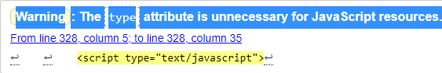

This warning was found throughout the HTML code where javasvript was used. It was addressed by deleting the ```type="text/javascript"``` and tested again. Cleared.

Wishlist Logo issue in navbar

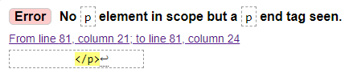

Error affecting all pages on the website due to the Wishlist navbar icon nestling block level elements within p tags. The error was fixed by replacing the ```<p>``` tags with ```<div>```. Fix source [here](#https://stackoverflow.com/questions/21084870/no-p-element-in-scope-but-a-p-end-tag-seen-w3c-validation)

Wishlist page

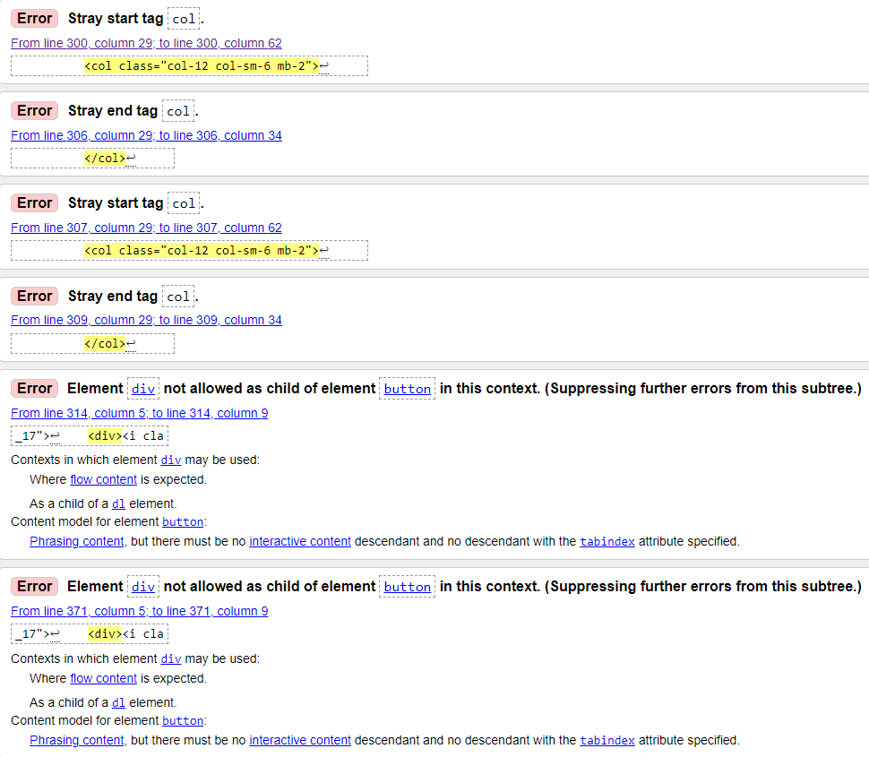

Simple mistake. Changed "col" tag div.

Buttons

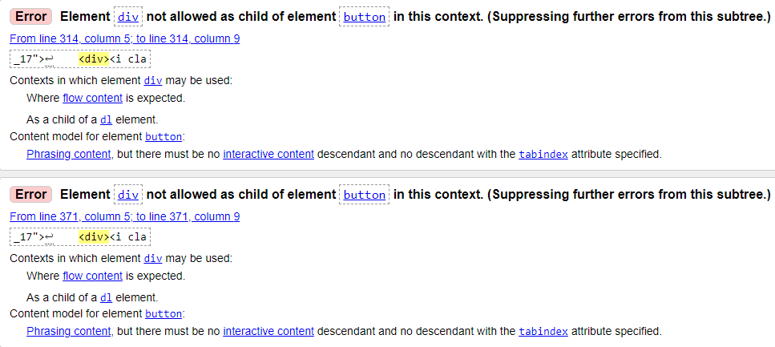

Divs were removed and then br tag added to create button shape.
Found on wishlst and product detail page with buttons.
edit product, edit review and remove product and remove review. divs inside buttons. deleted divs and just added br for button shape.

Pass all custom HTML

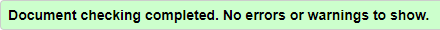

After checking all custom pages and leaving some of the original code (from the Boutiqe Ado tutorial), the HTML cleared all errors.

# W3C CSS Validator - CSS Testing

[W3C CSS Validator](https://jigsaw.w3.org/css-validator/#validate_by_input)

CSS Validation was tested on the base.css file found within the static folder.

base.css - returned no errors

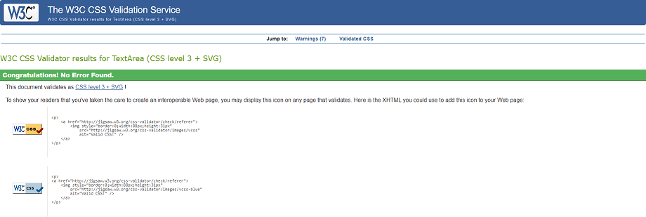

checkout.css - returned no errors

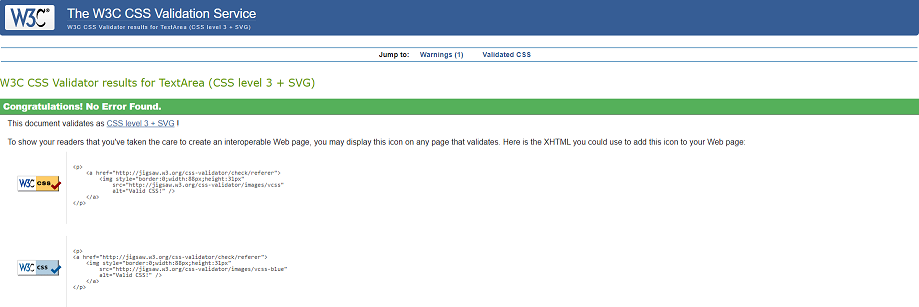

# JSHint - JavaScript Testing

[JSHint](https://jshint.com/) found one issue with a missing semicolon. That was addressed and cleared once ran through JSHint again.

stripe-elements.js

One undefined error on line 21 - "Stripe". This can be ignored as it comes from another script.

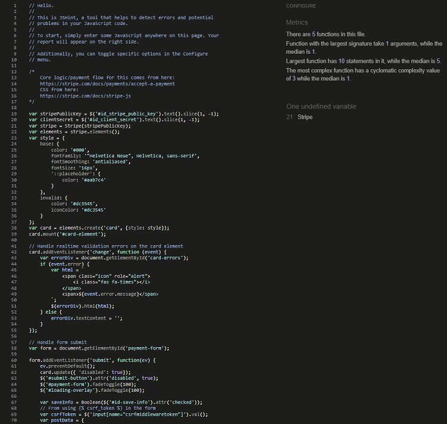

countryfield.js - no errors found

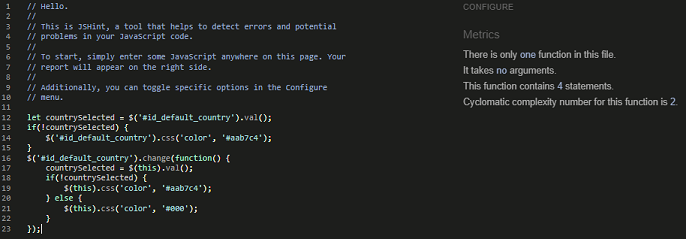

## PEP8CI - Python Testing

Using Code Institite's [PEP8CI](https://pep8ci.herokuapp.com/) to lint the code. Tested all Python code present. All clear.

bag app = all clear
checkout app = all clear - some lines too long, fixed.
home app = all clear
contact app = all clear
morgan_and_co = all clear
products app = some lines too long in views.py, cleared
profiles app = some lines too long, cleared
reviews app = some lines too long, cleared

By typing ```python3 -m flake8``` in the terminal, this checked all again. Migrations and automatically generated files were ignored.
Other linting issues are for unused apps found in test and other files after craeting apps. These can be ignored.

[Back to table of contents](#table-of-contents)

# Testing Original User Stories

Following are the original User Stories set out in the early design stages of the project found on the [README](README.md) page. They were individually tested to see if each goal was satisfied against the completed project.

### As a New Visitor
| User Story ID | I want to: | So that I can: |
| ------------- | ----------| ------------- |
| 001           | Be able to access and view the website on the device I'm using. | View the website without having to change my device. |
| 001 Result    | The website has been tested for ease of access and responsiveness on dozens of devices (handheld devices such as mobile phones and tablets, laptops, desktop computers and larger Samsung TVs) and is fully responsible from at least a minimum of 320px up to at least 1200px. It is very likely that the website will be displaying and working correctly on your current device. |
| 002           | Immediately understand the purpose of the website. | Decide if it's something I'm interested in. |
| 002 Result    | The background-image, titles, links and other written information along with the products list on display enable first-time users to easily understand the website, the theme and it's purpose. |
| 003           | Be able to navigate the website with ease. | Discover what the website is about and find all that I need. |
| 003 Result    | The website's intuitive design, responsive nav bar with clear and obvious menu options, colour contrast between text and the use of images, interactive prompts and layout make it very easy to navigate for first-time users. |
| 004           | Find the website design visually pleasing. | Have a pleasant experience. |
| 004 Result    | The use of imagery, clean and sophisticated design and pleasant colour palette creates a very enjoyable browsing experience for the user. |
| 005           | Be able to find help and information about the website and company. | Decide if the company is trustworthy and reputable. |
| 005 Result    | General information and links can be found in the website footer, along with the company's dedicated About page and other helpful customer information. |
| 006           | Be able to contact the company if I wish to, by my prefer method. | Easily contact the company and better understand any further queries I have. |
| 006 Result    | The footer contains the company address, email, telephone number and social media links, which is present on every page of the website. Minimal styling ensures that the links and contact info are displayed clearly and to not overwhelm users. All social media links open to a new tab where the user can decide on contacting the company through their desired social media platform. All contact information can also be found on the company's dedicated Contact page.
| 007           | Have a reason to return. | Explore the website further. |
| 007 Result    | There are a number of reasons to return to the Morgan & Co website. To keep up to date with the newest arrivals, new sale products. To quickly purcahse products with or without being a registered user. Visitors have the option to register for free and have a profile. Registered users have exclusive access to the wishlist and review features. To easily contact the company. |

### As an Unregistered User (including all prior stories)
| User Story ID | I want to: | So that I can: |
| ------------- | ----------| ------------- |
| 101           | Access and view the website on a number of different devices. | Visit the website from any device I'm currently using or would like to use in the future. |
| 101 Result    | The website has been tested for ease of access and responsiveness on dozens of devices (handheld devices such as mobile phones and tablets, laptops, desktop computers and larger Samsung TVs) and is fully responsible from at least a minimum of 320px up to at least 1200px. It is very likely that the website will be displaying and working correctly on any device that you wish to visit the Morgan & Co website. |
| 102           | Be able to easily register for an account. | Have my own profile, manage all that I wish from there and make it easier to return to the website. |
| 102 Result    | Anyone can register for free as long as they have an email address and correctly fill the register form. Once this email has been confirmed, the registered user can view their profile and have access to all of the website's exclusive features. |
| 103           | Buy products without registering. | Save time without needing or wanting to create an account. |
| 103 Result    | Any visitor can go through the process of purchasing products from the website, without the need to register. The checkout form must be filled in correctly and to valid form of payment must be given. |

### As a Shopper (including all prior stories)
| User Story ID | I want to: | So that I can: |
| ------------- | ----------| ------------- |
| 201           | View a list of all products. | See every item that the company sells. |
| 201 Result    | All products can be viewed by either selecting 'Shop by Item' then 'All Furniture' or by selecting 'Shop by Room' then 'All Rooms' from the navigation bar at the top of the page. Both routes will give you a list of every product on the website. 'All Furniture' can also be slected from the footer at the bottom of every page. |
| 202           | View specific product details. | To gather all information that I need about a certain product e.g price, description, rating and reviews. |
| 202 Result    | Product images can be clicked on (or pressed on) to advance to that specific products product detail page, where further infomation regarding that product is listed such as price, description, rating and reviews. |
| 203           | To quickly search for products by my preferred criteria e.g. name, description. | So that I can quickly find products that suit my desires. |
| 203 Result    | A saerch bar is avaiable on all screen sizes (or through the search icon on mobile), allowing users to search by their preference on names, descriptive words etc. |
| 204           | Easily see what I've searched for and the number of results found. | Quickly see whether the product I want is available. |
| 204 Result    | Once a search is made, a new page informs the user of the number of results found for their search term. This is seen towards the top of the page - just before any products are listed |
| 205           | Easily sort products by name, price and more. | To save time and better my decision-making. |
| 205 Result    | A sorting dropdown is present on every product list page. Users can sort products in alphabetical order, price, categories, rooms and specials. These sorting options are in both ascending and descending order. |
| 206           | Be able to filter products by items. | Find specific items I need without searching the entire product range. |
| 206 Result    | All items can be viewed by selecting 'Shop by Items' > 'All Furniture' from the navigation bar at the top of the page. Specific items can be filtered by selecting 'Shop by Item' then 'Chairs', 'Sofas', 'Tables', 'Cabinets' from the top of the page. This can also be done from the footer at the bottom of every page. |
| 207           | Be able to filter products by different rooms. | Find a range of items that suit a specific room. |
| 207 Result    | All products can be filtered by selecting 'Shop by Room' > 'All Rooms' from the navigation bar at the top of the page. Specific products can be filtered by their rooms by selecting 'Shop by Room' then 'Bedroom', 'Kitchen', 'Dining Room', 'Living Room' from the top of the page. |
| 208           | Find new items. | So that I can find what products are new to the store. |
| 208 Result    | New items to the store can be found be selecting the 'New Arrivals' link at the top of the page in the navigation bar. |
| 209           | Find clearance items. | So that I can find what products are on sale to be cleared and take advantage of the savings. |
| 209 Result    | Clearance products can be found be selecting the red 'Clearance' link towards the top of the page in the navigation bar. |
| 210           | Quickly find out about delivery details. | So that I gather information about cost and when I should receive my order. |
| 210 Result    | The delivery cost is given on the bag and checkout pages. Users are informed of the Free Delivery promotion via the banner found on every page. They are also informed of how much they need to spend to trigger the free delivery promotion whenever they update their bag, via on-screen popups. Delivery details can also be found in the footer links under 'Information'. |
| 211           | Read product reviews. | So that I make a better decision about each product. |
| 211 Result    | Product reviews left by other registered users can be found on product detail pages, underneath the product information. |
| 212           | Select the quantity of items I wish to purchase. | Easily make changes without unnecessary steps/clicks to alter the quantity. |
| 212 Result    | This can be done via the quantity selector on the product detail page before adding to the product to the shopping bag, and again at the shopping bag page before advancing to the checkout page. |
| 213           | Be informed of my bag total. | So that I can be easily informed of how much I'm spending and control that. |
| 213 Result    | Users are informed of their bag total cost by the shopping bag icon located in the navigation bar at the top of every page. An on-screen popup also gives a brief review of the products and cost. These are updated with every change made to their shopping bag. Total cost is also found on the shopping bag page and at the checkout page. |
| 214           | Easily view my bag. | So that I can see what products I have in my bag, the cost and the quantity before checkout. |
| 214 Result    | Simply click on the shopping bag icon within the navigation bar at the top of the webiste at any time. |
| 215           | Know that my information and payment details are safe and secure. | So that I can shop with confidence and feel safe about giving my personal details. |
| 215 Result    | All company information and contact information is provided. Payment details and methods are handled via Stripes secure system. See [here](https://stripe.com/docs/security) for more information. |
| 216           | Easily enter my payment information. | Check out quickly without needing to create an account or following numerous steps. |
| 216 Result    | Users can buy products without creating an account by just filling in the necessary delivery and payment information. |
| 217           | Recieve an order review after checkout. | So that I can quickly see my purchase and check if I purchased all that I needed. |
| 217 Result    | Once checkout is complete, the user is met with an order review. This specifies the users name, the order number, order date, products bought, the quantity, the individiual and total price, delivery cost if applicatable and delivery address. The user email is also given. |
| 218           | Recieve a confirmation via email of my order. | Keep the order confirmation as proof of purchase. |
| 218 Result    | An email is automatically sent out the the users email address given at the checkout form. This is directed personally to the user and specifies an order number, date, address to be delivered to and the cost details. The company email is given incase the customer wishes to contact Morgan & Co. |


### As a Registered User (including all prior stories)
| User Story ID | I want to: | So that I can: |
| ------------- | ----------| ------------- |
| 301           | Have my own personal profile with some management options. | Manage my own personal information. |
| 301 Result    | Registed users can view their profile from the 'My Account' logo then select 'My Profile'. Their default delivery address is saved here and can be updated too. An order history and a link to their wishlist is also present. |
| 302           | Have access to more features. | Justfiy registering to the website. |
| 302 Result    | Registered users have profile management, a wishlist feature and a review feature. |
| 303           | Recieve an email confirmation after registering. | Verify that my account registration was successful. |
| 303 Result    | Newly registered users will receieve an email that they must confirm (by clicking the link) to complete their registration and have access to their account. |
| 304           | Be able to edit my personal information e.g. address, email. | Manage my own personal information in case they change. |
| 304 Result    | This is all done in the My Profile section of their account. Users can also choose to save their current information at the checkout page if they wish. |
| 305           | Easily sign in and sign out of my account. | Quickly access or leave my personal profile when using the website. |
| 305 Result    | This is done through the 'My Account' logo, then selecting 'Sign In'/'Sign Out'. They will be asked confirm it. Whenever users currently NOT signed in attempt to use or access exclusive features or part of the website (e.g add reviews) they will be informed of this and asked to sign up or sign in. |
| 306           | Be able to recover my password in case I forget it. | Recover access to my account and all my personal information. |
| 306 Result    | The user can click on the 'Forgot Password?' link from the Sign In page. After entering their email they will receieve an email from Morgan & Co which asks them to enter a new password before retrieving their account. |
| 307           | Have access to my order history. | Can view all previous orders. |
| 307 Result    | The order history can be viewed from My Profile, detailing the order number, order date, items including quantities and the orders total price. |
| 308           | Add product reviews. | Leave reviews on specific products. |
| 308 Result    | This can be done from the reviews section on the product detail page of each product. Fill in the form underneath the product information. A maximum of 1 review can be left per product by a registered user. If the user has already left a review on a product, they are informed of this. |
| 309           | Edit product reviews. | Edit reviews on specific products. |
| 309 Result    | This can be done from the review section on the product detail page on each product. Click the 'Edit' button on your current review and update the pre-populated form. A registered user can only edit their own review if they have already left one on a specific product. |
| 310           | Delete product reviews. | Delete reviews on specific products. |
| 310 Result    | This can be done from the review section on the product detail page on each product. A registered user can only delete their own review if they have already left one on a specific product. Click 'Remove Review' button on the review. Before they review is deleted, the user is met with an on-screen popup, asking if they are sure. Confirming this will delete their product review. |
| 311           | Add items to my wishlist. | Easily access a list of products I'm interested in viewing again and/or purchasing. |
| 311 Result    | This can be done by clicking or pressing the 'Add to Wishlist' button underneath products on any product details page. If the item is already in the users Wishlist, they are informed of this. |
| 312           | Delete specific products from my wishlist. | Delete specific products that I no longer wish to have. |
| 312 Result    | This can be done directly from the users Wishlist page. Each item has a 'Remove from Wishlist' button linked to it. Once clicked/pressed, the user is met with an on-screen popup, asking if they are sure. Confirming this will delete product from their wishlist. |
| 313           | Choose whether to save my delivery information. | For ease of future use and security reasons. |
| 313 Result    | Users can tick a box on the checkout form to save their personal info for the next time they visit. |

### As a Store Owner (including all prior stories)
| User Story ID | I want to: | So that I can: |
| ------------- | ----------| ------------- |
| 401           | Have more control and features than any other user. | Manage my store easily. |
| 401 Result    | These are listed below. Store owners also have all the features and accessibility that a registered user has - but are not limited to just their own information and account. |
| 402           | Have access to an admin portal. | Access and manage all store tasks in greater depth. |
| 402 Result    | Store owners can secruely access the admin portal where they will have total control and admin rights to add, edit/update and delete all data on their website. |
| 403           | Be able to create other super user accounts. | Create super user accounts with advanced control. |
| 403 Result    | This can be done from the admin portal by selecting the Users section then 'Add User' button. Once the account is confirmed, the store owner can give superuser rights to the user by selecting their username and ticking the Superuser status box. |
| 404           | Be able to add a product to my store. | Add new product to my store. |
| 404 Result    | Once signed in as admin/store owner on the website, select 'My Account' then 'Product Management' and fill in the form. This can also be done from the admin portal by selecting 'Products' then 'Add Product' button and filling in the form there. |
| 405           | Be able to edit/update a specific product. | Change product prices, descriptions, images and other product criteria. |
| 405 Result    | Once signed in as admin/store owner on the website, go to the product details page of any product you wish to edit then click/press the 'Edit' button. The next page will have a pre-populated form that you can then edit. This process can also be done from the admin portal by selecting 'Products' then selecting the product from the list and editing the form there. |
| 406           | Be able to delete a product from my store. | Remove items that are no longer for sale. |
| 406 Result    | Once signed in as admin/store owner on the website, go to the product details page of any product you wish to delete then click/press the 'Delete' button. The onscreen popup will ask you to confirm or cancel the step. This process can also be done from the admin portal by selecting 'Products' then selecting the product from the list and deleting form there, or by selecting multiple products at the same time and choosing 'Delete selected products' from the dropdown. |
| 407           | Be able to add product categories (including basic Catgegory, Room and Specials.) | Add new categories to my store. |
| 407 Result    | This can also be done from the admin portal by selecting 'Add' next to the Categories/Rooms/Specials option in the Products menu, or selecting your preference then clciking 'Add Catgegory'/'Add Room' or 'Add Specials' button. The option will then be made avaiable on your product forms. |
| 408           | Be able to edit/update product categories (including basic Catgegory, Room and Specials.) | Edit/Update any current store categories. |
| 408 Result    | This can also be done from the admin portal by selecting the preferred Categories/Rooms/Specials option in the Products menu, then selecting your preferred choice again. Edit the name and friendly_name here. Once saved, this change will then be updated on all forms. |
| 409           | Be able to delete product categories (including basic Catgegory, Room and Specials.) | Delete any current categories. |
| 409 Result    | This can also be done from the admin portal by selecting the preferred Categories/Rooms/Specials option in the Products menu, then selecting your preferred choice again. Click the 'Delete' button here. Alternatively, you can select multiple options and clicking the dropdown to delete all at once. Once confirmed, this change will then be updated an all forms. |
| 410           | Be able to add product reviews to any specific product. | Leave storeowner reviews on any specific products. |
| 410 Result    | This can be done from the admin portal through the Reviews then 'Add Review' button and filling in the form there. This can also be done for all products from the product detail page, just like a registered user would be able to. The store owner is also able to add product reviews for specific users from the admin portal, by selecting the 'Review author' from the form. |
| 411           | Be able to edit/update all product reviews. | Edit/Update any user reviews on any specific products. |
| 411 Result    | This can be done from the admin portal through Reviews then selecting any review form there, then editing them. This can also be done for all products from the product detail page, just like a registered user would be able to - although with the ability to edit all user reviews. |
| 412           | Be able to delete any specific product reviews. | Delete any user reviews on specific products. |
| 412 Result    | This can be done from the admin portal by going to Reviews, then selecting the review. Click the 'Delete' button here. Alternatively, you can select multiple options and clicking the dropdown to delete all at once and confirming this. The store owner also has the ability to delete any review left by an user by pressing the 'Remove Review' button next to their review on the product detail page. |
| 413           | Be able to add user wishlist. | Add new wishlists for any registered user. |
| 413 Result    | This is done from the admin portal by selecting 'Add' next to Wishlist or by selecting Wishlist then the 'Add Wishlist' button. Fill in the form and choose the user there. |
| 414           | Be able to edit/update all user wishlsts. | Edit/Update any current user wishlist. |
| 414 Result    | This is done from the admin portal by selecting 'Change' next to Wishlist or by selecting Wishlist then selecting the users wishlist you wish to change from the entire list. Edit the form and Save. |
| 415           | Be able to delete user wishlists. | Delete any user wishlist from their profile. |
| 415 Result    | This can also be done from the admin portal by going to Wishlist, then selecting the individual wishlist. Click the 'Delete' button here and confirm. Alternatively, you can select multiple user wishlists and clicking the dropdown to delete all at once and confirming this. |
| 416           | Be able to add user account and info. | Create and control user account and info on my website. |
| 416 Result    | This can be done from the admin portal by selecting 'Add' next to the Users option, or by selecting Users then clicking 'Add User' button and filling in the form. Save. Emails can be added by selecting 'Add' next to the 'Email addresses' option, or by selecting Email addresses then clicking 'Add Email Address' button and filling in the form. Save. |
| 417           | Be able to edit/update all user account and info. | Edit/Update any current user account and info on my website. |
| 417 Result    | This can be done from the admin portal by selecting the Users option, then choosing the user from the list. Edit the form and Save. Emails can be edited by selecting 'Email addresses' from the main admin menu, then choosing the email from the list and edit the form. Save. |
| 418           | Be able to delete user accounts and info. | Delete any current user account and info from my website. |
| 418 Result    | This can be done from the admin portal by selecting the Users option, then choosing the user from the list. Press the 'Delete' button and confirm. Alternatively, you can select multiple users from the list and clicking the dropdown to delete all at once and confirming this. Emails can be edited by selecting 'Email addresses' from the main admin menu, then choosing the email from the list and Delete button from the form. Confirm it. Alternatively, you can select multiple email addressed from the list and clicking the dropdown to delete all at once and confirming this. |

[Back to table of contents](#table-of-contents)

# Automated Testing

Used Django's built in testing framekwork to create automatic testing for the Morgan & Co website. This was done to ensure the written code was working as expected, on top of the manual testing and validation done.

import TestCase class, then used all of its functionality to create custom classes to test the following in each app, if present:
tested forms through the test_forms.py
tested views through the test_views.py
tested models through the test_models.py

[Coverage](https://pypi.org/project/coverage/) was then used to check how much of the code was tested

[Back to table of contents](#table-of-contents)

# Lighthouse

Following are the Google Chrome Lighthouse results for each page.

Changes were made due to the results of the Lighthouse tests. These were:
- Adeed a meta description and content to boost overall SEO website score.
- Added aria-label to buttons to boost accesibility further.
- Fixed sequential headings.
- Improved contrasting.

## Homepage

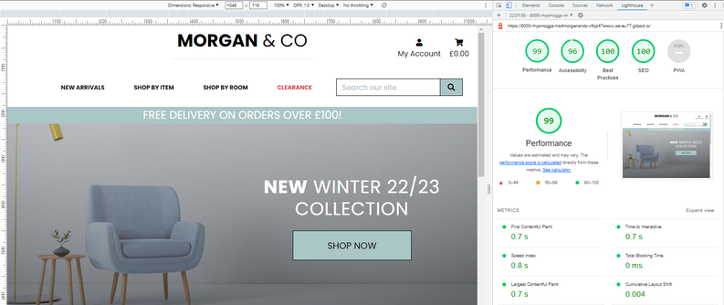

## Products

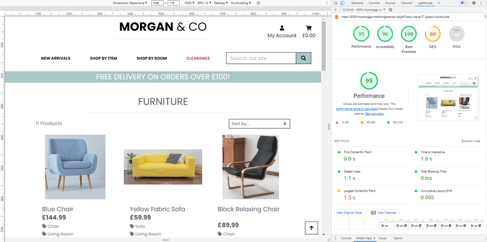

## Product Detail

Accessibility below 90% due to label missing on the quantity selector form.

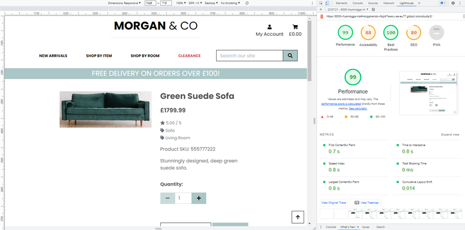

SEO and overall score higher when no reviews present on page.

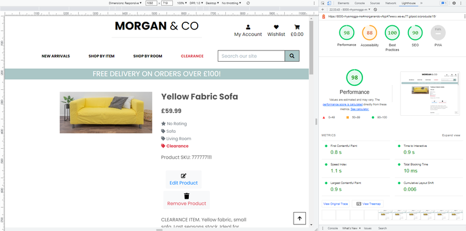

## My Profile

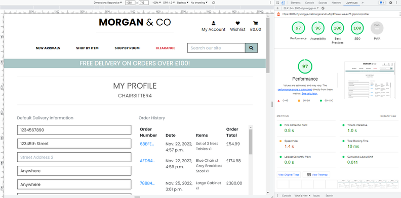

## Wishlist

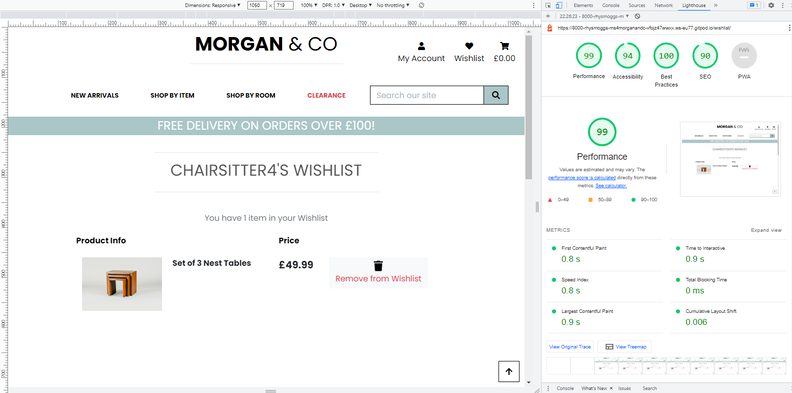

## Edit Review

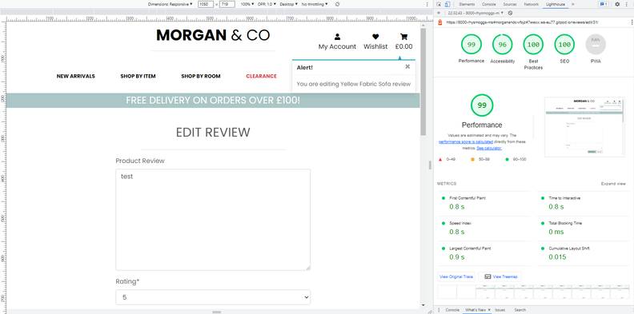

## Shopping Bag

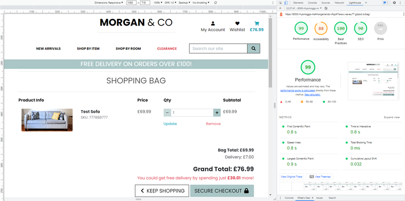

## Checkout

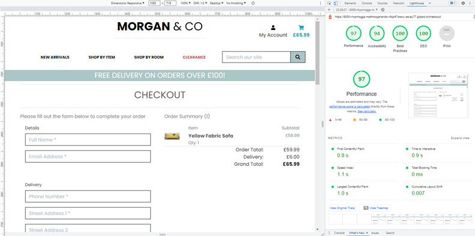

## Checkout Success

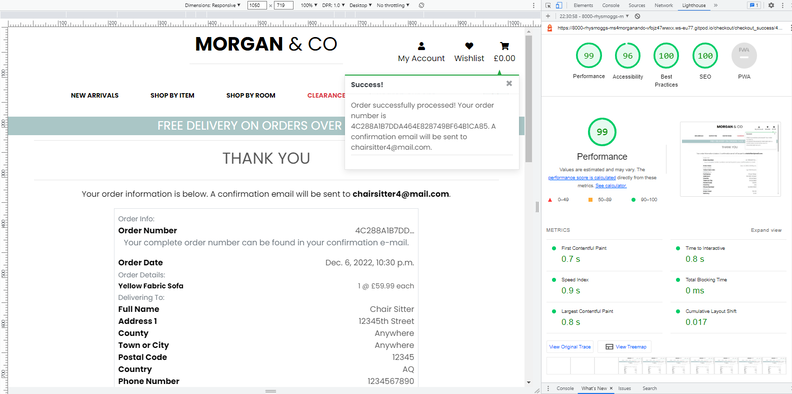

[Back to table of contents](#table-of-contents)

# Further Testing

- Testing was constantly done using Google Chrome's own developer tools and 'Inspect Mode', although testing was done sporadically on alternative browsers with each major addition to the website e.g new content, style updates and responsive changes via media queries.
- The browser console was used for error finding and print() in code development.
- All interactive elements of the website were tested. Button functions, clicking, hiding/showing content, user input, links and general flow of the website. Database CRUD functionality and testing were made in real-time. Known bugs were fixed as they arose or as a whole with media queries.
- The website was tested on Google Chrome, Mozilla Firefox, Microsoft Edge and Opera browsers and ran efficiently on each one. There were slight stylistic differences when testing between browsers, but these were resolved afterwards.
- The website was viewed on a variety of devices such as Desktop, Laptop, iPad & iPhoneX.
- Feedback from friends and family, testing the website with no prior instruction or expectations. Adjustments were made if necessary to satisfy the User Stories targets.

## Stripe Testing

Testing was done using their recommended practices. It was vital that these tests worked successfully, as obviously an integral part of any e-commerce store is the payment functionality and security. All tests passed with expected results.

All Stripe testing documentation can be found [here](https://stripe.com/docs/testing)

Input the following card payment details and the checkout page to test and emulate the process of a successful payment:

Long Card Number: 4242 4242 4242 4242  
Expiry Date: Enter any date in the future with mm/yy  
CVC (3-digit securiity number): Enter any 3 digits  
ZIP: Enter any 5 digits

Testing for authentication was handled by their [3D Secure Authentication](https://stripe.com/docs/testing#regulatory-cards) tool. This link gives different card details for further testing.

## Webhooks

Webhooks were tested during development abnd followed the same practice covered in Code Institute's 'Boutique Ado' tutorial, which this project used as guidence.

Common errors found and fixed during the development process: 

error code: 404? 400s?
200
, which are usually associated with server errors,

All tests returned successful and expected results.

Final testing was done on the deployed Heroku website, as this ensures the webhook url remain constant and matches that of the Morgan & Co address.

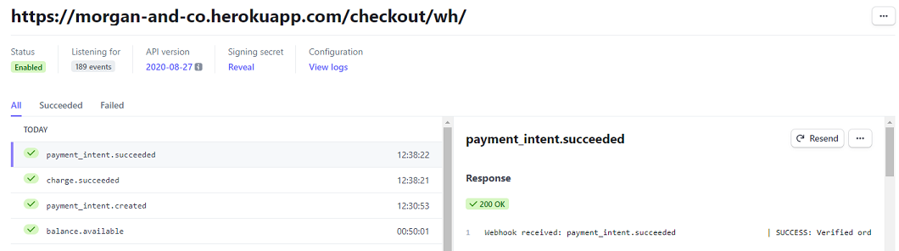

[Back to table of contents](#table-of-contents)

# Bug Fixes

Favicon console error [fix](https://www.w3schools.com/html/html_favicon.asp). Resolved by adding a favicon image, created [here](https://favicon.io/favicon-generator/). Added image to the static/images folder and linking it in the templates/base.html file.

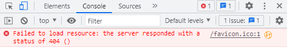

[Back to table of contents](#table-of-contents)

# Known Bugs

[Back to table of contents](#table-of-contents)

# Testing Credits
## Reading and Guidence
## Code

[Back to table of contents](#table-of-contents)